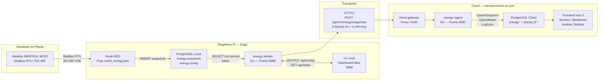
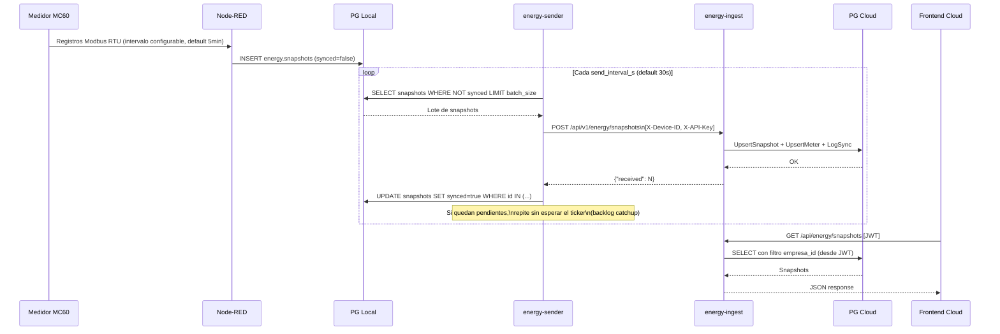
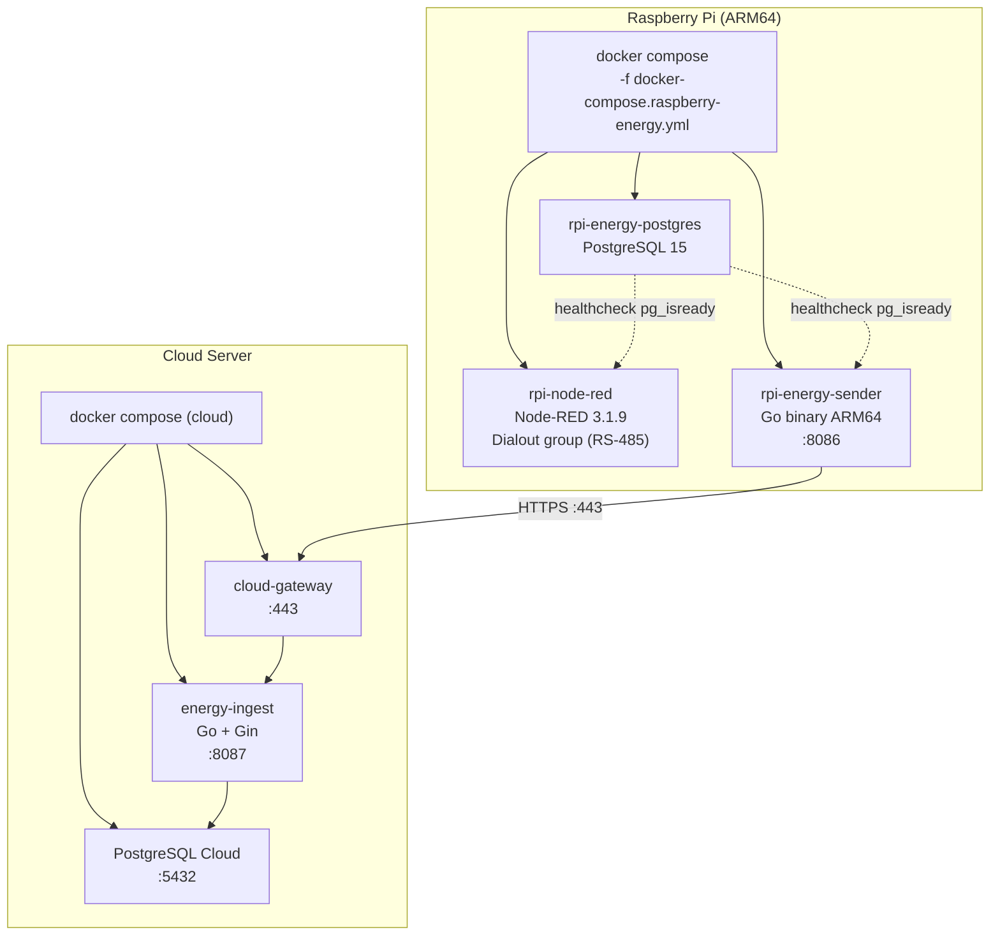
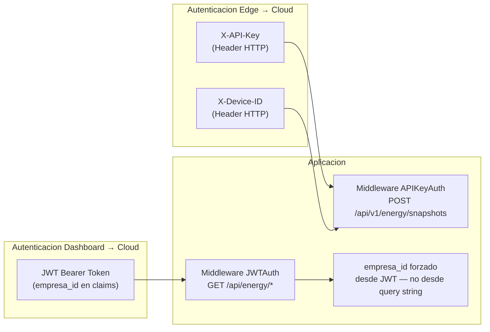

# ENERGY 01 — Arquitectura General del Subsistema de Energía

## 1. Descripcion

El subsistema de energía mide, almacena y transmite datos eléctricos desde medidores físicos instalados en planta hasta la plataforma cloud, donde son visualizados y analizados. Está diseñado para operar con resiliencia ante cortes de conectividad, garantizando que ninguna medición se pierda.

---

## 2. Componentes del Sistema

---

## 3. Stack Tecnologico por Capa

| Capa | Tecnologia | Rol |
|---|---|---|
| Hardware | MEATROL MC60 | Medicion electrica trifasica via Modbus RTU |
| Adquisicion | Node-RED 3.1.9 | Lectura Modbus RTU, persistencia local |
| Buffer Edge | PostgreSQL 15 (Alpine) | Cola local de snapshots con flag `synced` |
| Envio Edge | Go (energy-sender) | Envio batch al cloud, catchup ante desconexion |
| UI Edge | HTML/JS embebido en Go | Configuracion y monitoreo local en RPi |
| Ingesta Cloud | Go + Gin (energy-ingest) | Recepcion, validacion, persistencia multitenancy |
| Base Cloud | PostgreSQL (cloud) | Schema `energy.*` global + schemas por planta |
| Frontend Cloud | Vue 3 + Vite | Visualizacion, analisis tarifario, gestion de medidores |

---

## 4. Flujo de Datos de Extremo a Extremo

---

## 5. Modelo de Despliegue

---

## 6. Variables de Configuracion Edge

La configuracion operacional del edge se almacena en `energy.config` (PostgreSQL local) y se recarga en caliente sin reiniciar contenedores.

| Clave | Descripcion | Valor por Defecto |
|---|---|---|
| `device_id` | Identificador unico del dispositivo edge | *(vacio — obligatorio)* |
| `meter_id_1` | ID del medidor Modbus | *(vacio — obligatorio)* |
| `meter_unit_id` | Direccion Modbus del medidor | `1` |
| `cloud_url` | URL base del cloud | `https://mentormonitor-ai.com` |
| `energy_api_key` | API key de autenticacion al cloud | *(vacio — obligatorio)* |
| `send_interval_s` | Intervalo de envio en segundos | `30` |
| `batch_size` | Tamano maximo del lote por envio | `50` |
| `config_reload_s` | Intervalo de recarga de config desde DB | `60` |

---

## 7. Seguridad

- El `empresa_id` nunca se acepta desde el query string en endpoints del dashboard; siempre se extrae del JWT para garantizar aislamiento de datos entre empresas.
- La API key se almacena en `energy.config` en el edge y se transmite via HTTPS.
