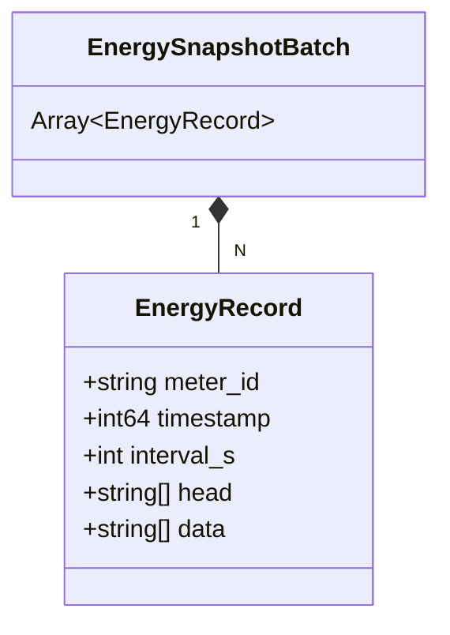
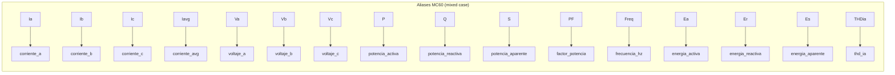
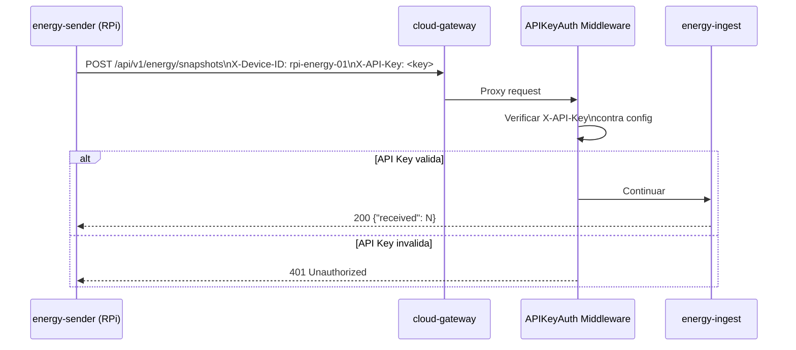
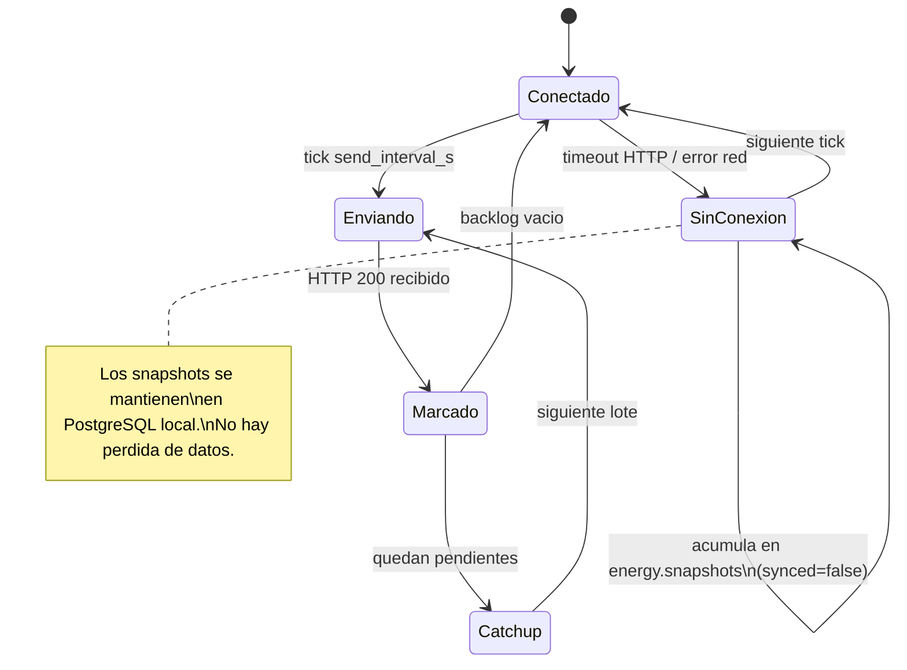

# ENERGY 03 — Contrato de Datos: Edge → Cloud

## 1. Descripcion

Define el protocolo HTTP y el schema JSON utilizado por `energy-sender` para transmitir snapshots eléctricos al servicio `energy-ingest` en el cloud. Este contrato es la interfaz de integracion entre el subsistema edge y el cloud.

---

## 2. Endpoint de Ingesta

```
POST /api/v1/energy/snapshots
Host: mentormonitor-ai.com
Content-Type: application/json
X-Device-ID: <device_id>
X-API-Key: <energy_api_key>
```

### Respuesta exitosa (`200 OK`)

```json
{ "received": 15 }
```

### Respuestas de error

| Codigo | Condicion |
|---|---|
| `400` | Body invalido, JSON malformado, o `X-Device-ID` ausente |
| `401` | API key invalida o ausente |
| `500` | Error interno al persistir en la base de datos |

---

## 3. Schema del Payload

El cuerpo es un array JSON de snapshots (`EnergySnapshotBatch`), definido en `shared-contracts/energy.schema.json`.



### Descripcion de campos

| Campo | Tipo | Requerido | Descripcion |
|---|---|---|---|
| `meter_id` | string | Si | Identificador del medidor dentro del dispositivo (ej. `"meter-01"`) |
| `timestamp` | integer | Si | Unix timestamp en **milisegundos** del momento de la medicion |
| `interval_s` | integer ≥ 1 | Si | Intervalo de muestreo en segundos (ej. `300` para 5 min) |
| `head` | string[] | Si | Nombres de columnas Modbus (ver tabla de aliases) |
| `data` | string[] | Si | Valores correspondientes a `head`, codificados como strings |

> El `device_id` no va en el payload; se toma del header `X-Device-ID`.

---

## 4. Ejemplo de Payload

```json
[
  {
    "meter_id": "meter-01",
    "timestamp": 1745400000000,
    "interval_s": 300,
    "head": ["Ia", "Ib", "Ic", "Va", "Vb", "Vc", "P", "Q", "S", "PF", "Freq", "Ea", "Er"],
    "data": ["12.5", "12.3", "12.8", "220.1", "219.8", "220.5", "8250.0", "1200.0", "8337.0", "0.989", "60.01", "1540.2", "224.0"]
  }
]
```

---

## 5. Mapeo de Aliases Modbus → Campos Normalizados

El servicio `energy-ingest` normaliza los nombres de columnas recibidos en `head[]` usando la funcion `ExtractFields()` definida en `domain/extract.go`. Acepta tanto aliases en mayusculas (estandar) como aliases del MC60 (mixed case).



### Tabla completa de aliases

| Alias MC60 | Alias Estandar | Campo Normalizado | Unidad |
|---|---|---|---|
| `Ia` | `IA` | `corriente_a` | A |
| `Ib` | `IB` | `corriente_b` | A |
| `Ic` | `IC` | `corriente_c` | A |
| `Iavg` | `I_AVG` | `corriente_avg` | A |
| `In` | — | `corriente_neutro` | A |
| `Va` | `UA` | `voltaje_a` | V |
| `Vb` | `UB` | `voltaje_b` | V |
| `Vc` | `UC` | `voltaje_c` | V |
| `Vavg` | `U_AVG` | `voltaje_avg` | V |
| `Vab` | `UAB` | `voltaje_ab` | V |
| `Vbc` | `UBC` | `voltaje_bc` | V |
| `Vac` | `UAC` | `voltaje_ac` | V |
| `P` | `POTENCIA_ACTIVA` | `potencia_activa` | W |
| `Q` | `POTENCIA_REACTIVA` | `potencia_reactiva` | VAR |
| `S` | `POTENCIA_APARENTE` | `potencia_aparente` | VA |
| `PF` | `FACTOR_POTENCIA` | `factor_potencia` | — |
| `Freq` | `FRECUENCIA` | `frecuencia_hz` | Hz |
| `Ea` | `ENERGIA_ACTIVA` | `energia_activa` | kWh |
| `Er` | `ENERGIA_REACTIVA` | `energia_reactiva` | kVARh |
| `Es` | `ENERGIA_APARENTE` | `energia_aparente` | kVAh |
| `THDia` | `THD_IA` | `thd_ia` | % |
| `THDib` | `THD_IB` | `thd_ib` | % |
| `THDic` | `THD_IC` | `thd_ic` | % |
| `THDua` | `THD_UA` | `thd_ua` | % |
| `THDub` | `THD_UB` | `thd_ub` | % |
| `THDuc` | `THD_UC` | `thd_uc` | % |

---

## 6. Flujo de Autenticacion



---

## 7. Resiliencia ante Desconexion



Cuando se recupera la conectividad, el loop ejecuta envios consecutivos sin esperar el ticker hasta vaciar el backlog completo (`sendBatch()` retorna `true` mientras quedan pendientes).
