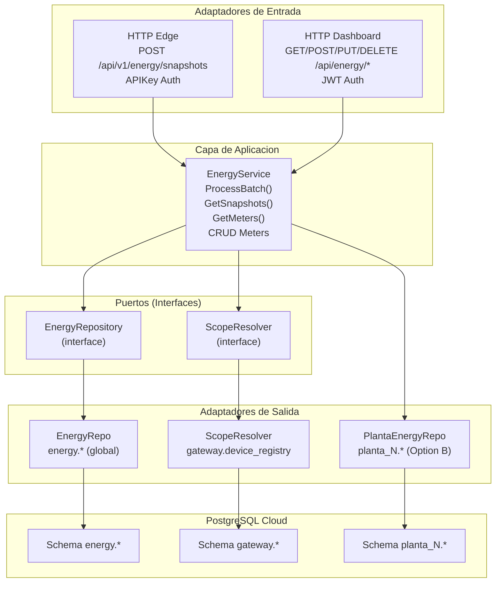
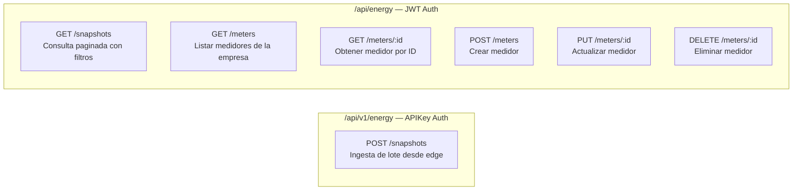
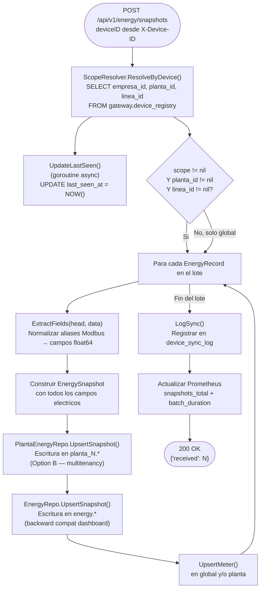
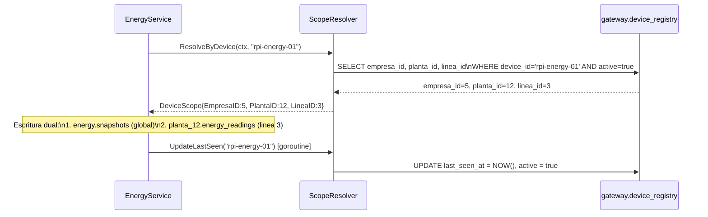
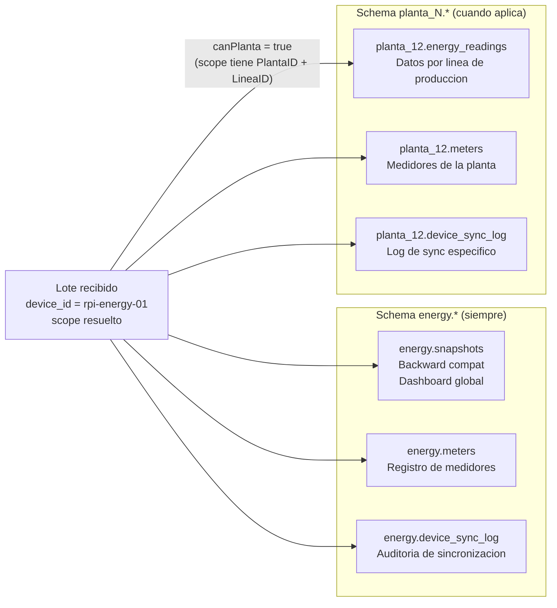
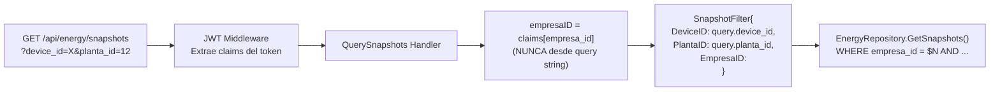

# ENERGY 04 — Servicio Cloud: energy-ingest

## 1. Descripcion

`energy-ingest` es el microservicio Go responsable de recibir, validar y persistir los snapshots eléctricos enviados por los dispositivos edge. Implementa arquitectura hexagonal (puertos y adaptadores) y soporta multitenancy con doble escritura: schema global `energy.*` y schema especifico de planta.

---

## 2. Arquitectura Hexagonal



---

## 3. Endpoints Registrados



| Ruta | Metodo | Auth | Descripcion |
|---|---|---|---|
| `/api/v1/energy/snapshots` | POST | API Key | Recibir lote de snapshots desde edge |
| `/api/energy/snapshots` | GET | JWT | Consultar snapshots con filtros y paginacion |
| `/api/energy/meters` | GET | JWT | Listar medidores de la empresa del token |
| `/api/energy/meters/:id` | GET | JWT | Obtener medidor por ID |
| `/api/energy/meters` | POST | JWT | Crear medidor |
| `/api/energy/meters/:id` | PUT | JWT | Actualizar nombre, ubicacion o estado |
| `/api/energy/meters/:id` | DELETE | JWT | Eliminar medidor |

---

## 4. Flujo de Procesamiento: ProcessBatch



---

## 5. Resolucion de Scope (Multitenancy)



---

## 6. Doble Escritura (Option B)



Si `canPlanta` es `false` (device no registrado o sin scope completo), solo se escribe en el schema global y se registra un error en el log sin interrumpir la ingesta.

---

## 7. Seguridad en Consultas del Dashboard



El `empresa_id` se extrae exclusivamente del JWT para garantizar que cada usuario solo accede a los datos de su empresa. Un usuario no puede consultar datos de otra empresa manipulando el query string.

---

## 8. Metricas Prometheus

| Metrica | Tipo | Labels | Descripcion |
|---|---|---|---|
| `energy_snapshots_total` | Counter | `device_id` | Total de snapshots procesados por dispositivo |
| `energy_batch_duration_seconds` | Histogram | `device_id` | Duracion de procesamiento de cada lote |
| `energy_errors_total` | Counter | `reason` | Errores clasificados por etapa (`read_body`, `parse`, `process`) |

---

## 9. Estructura de Directorios del Servicio

```
energy-ingest/
├── cmd/
│   └── main.go                    # Bootstrap, DI manual
├── internal/
│   ├── adapters/
│   │   ├── handler/
│   │   │   └── energy_handler.go  # HTTP handlers (Gin)
│   │   └── repository/
│   │       ├── db.go              # Pool de conexiones
│   │       ├── energy_repo.go     # Impl. EnergyRepository global
│   │       ├── planta_energy_repo.go  # Impl. repo planta (Option B)
│   │       └── scope_resolver.go  # Resolucion de scope por device
│   ├── application/
│   │   └── energy_service.go      # Logica de negocio
│   ├── domain/
│   │   ├── models.go              # Entidades de dominio
│   │   └── extract.go             # Normalizacion aliases Modbus
│   ├── metrics/
│   │   └── metrics.go             # Definicion de metricas Prometheus
│   └── ports/
│       ├── repositories.go        # Interfaces EnergyRepository, ScopeResolver
│       └── middleware.go          # APIKeyAuth middleware
└── Dockerfile
```
