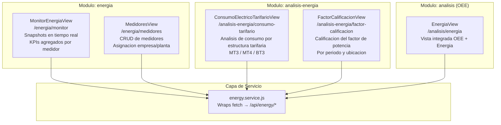
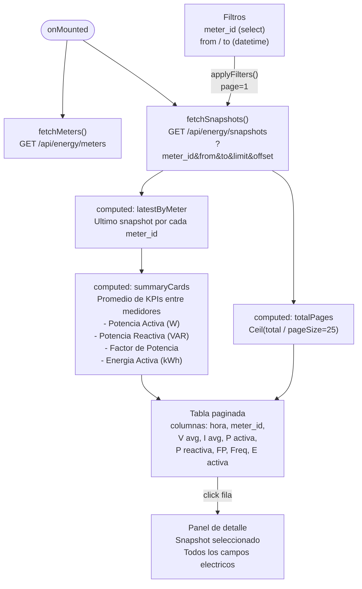
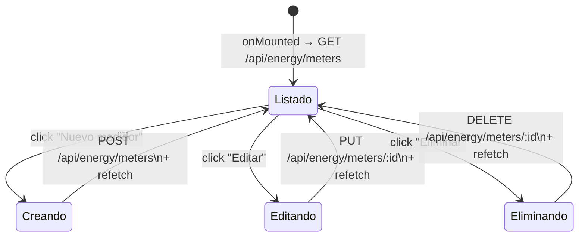
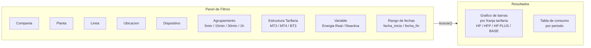
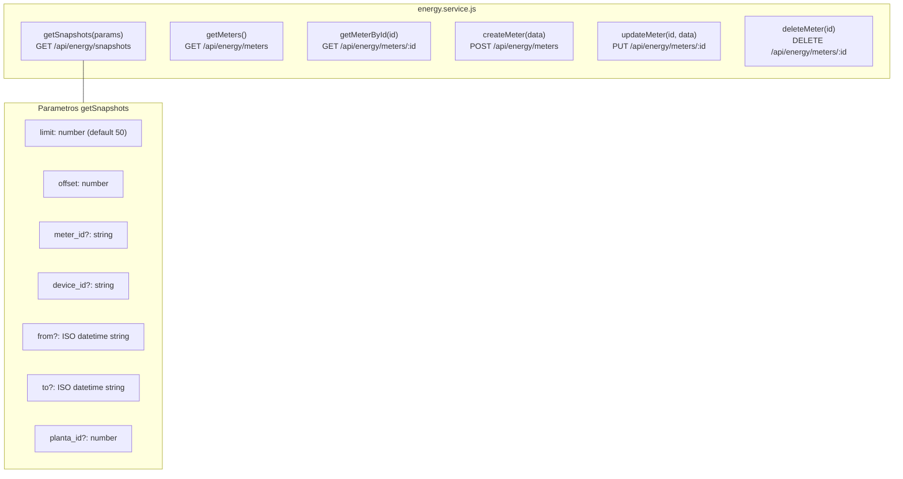
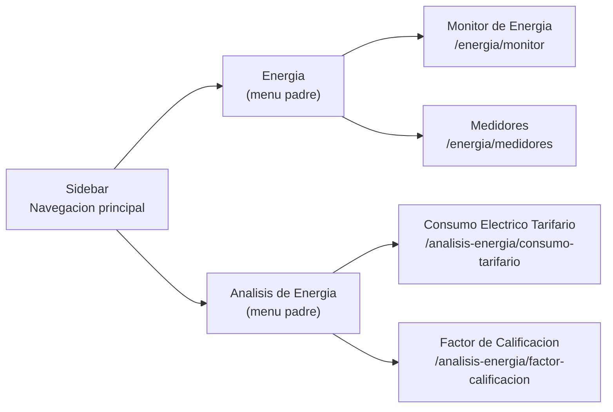

# ENERGY 05 — Frontend Cloud: UI de Energia

## 1. Descripcion

La UI cloud del subsistema de energía esta implementada en Vue 3 y se divide en dos modulos: `energia` (monitoreo en tiempo real y gestion de medidores) y `analisis-energia` (analisis tarifario y factor de calificacion). Todos los datos provienen del servicio `energy-ingest` via la capa `energy.service.js`.

---

## 2. Mapa de Modulos y Vistas

---

## 3. MonitorEnergiaView — Logica de Componente

### KPIs del panel de resumen

| Campo | Etiqueta | Unidad | Color |
|---|---|---|---|
| `potencia_activa` | Potencia Activa | W | Amarillo |
| `potencia_reactiva` | Potencia Reactiva | VAR | Azul |
| `factor_potencia` | Factor de Potencia | — | Verde esmeralda |
| `energia_activa` | Energia Activa | kWh | Morado |

### Columnas de la tabla principal

| Campo | Etiqueta | Formato |
|---|---|---|
| `hora` | Hora | datetime |
| `meter_id` | Medidor | string |
| `voltaje_avg` | V avg | V |
| `corriente_avg` | I avg | A |
| `potencia_activa` | P activa | W |
| `potencia_reactiva` | P reactiva | VAR |
| `factor_potencia` | FP | decimal |
| `frecuencia_hz` | Freq | Hz |
| `energia_activa` | E activa | kWh |

---

## 4. MedidoresView — CRUD de Medidores

Campos del formulario de medidor:

| Campo | Tipo | Descripcion |
|---|---|---|
| `device_id` | string | ID del dispositivo edge asociado |
| `meter_id` | string | ID del medidor Modbus |
| `nombre` | string | Nombre descriptivo |
| `ubicacion` | string | Ubicacion fisica en planta |
| `empresa_id` | int | Empresa (desde JWT en creacion) |
| `planta_id` | int | Planta de produccion |

---

## 5. ConsumoElectricoTarifarioView — Analisis Tarifario

### Estructuras Tarifarias Soportadas

| Codigo | Nombre | Descripcion |
|---|---|---|
| `MT3` | Media Tension 3 | Tarifa en media tension, sin discriminacion horaria |
| `MT4` | Media Tension 4 | Tarifa en media tension con dos periodos |
| `BT3` | Baja Tension 3 | Tarifa en baja tension |

### Franjas Horarias (colores de graficos)

| Franja | Color |
|---|---|
| HP (Horas Punta) | Rojo `#ef4444` |
| HFP (Horas Fuera Punta) | Ambar `#f59e0b` |
| HP PLUS | Violeta `#8b5cf6` |
| BASE | Azul `#3b82f6` |

---

## 6. Capa de Servicio: energy.service.js

Todos los metodos incluyen el JWT Bearer Token via el interceptor Axios/Fetch global del frontend. El `empresa_id` nunca se envia desde el cliente; el backend lo extrae del token.

---

## 7. Flujo de Navegacion

