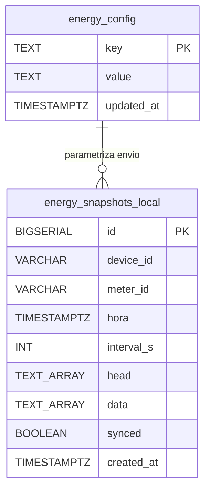
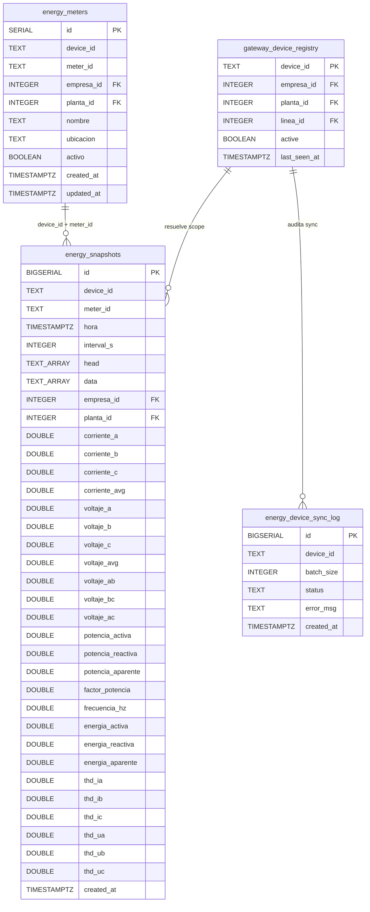
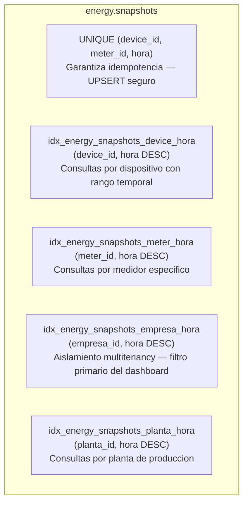
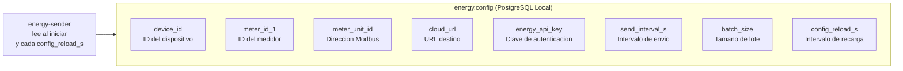
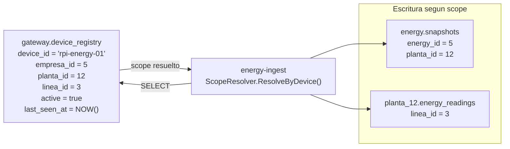

# ENERGY 06 — Modelo de Base de Datos

## 1. Descripcion

Documenta los schemas de base de datos del subsistema de energía en ambos extremos: la base local de la Raspberry Pi (`mentor_energy`) y el schema cloud (`energy.*` en PostgreSQL cloud). Incluye el vinculo con `gateway.device_registry` para la resolucion de scope multitenancy.

---

## 2. Diagrama Entidad-Relacion: Base Local Edge

---

## 3. Diagrama Entidad-Relacion: Schema Cloud `energy.*`

---

## 4. Descripcion Detallada: `energy.snapshots` (Cloud)

### Campos de Identificacion

| Columna | Tipo | Descripcion |
|---|---|---|
| `id` | BIGSERIAL PK | Clave primaria autoincremental |
| `device_id` | TEXT | ID del dispositivo edge (desde `X-Device-ID`) |
| `meter_id` | TEXT | ID del medidor Modbus dentro del dispositivo |
| `hora` | TIMESTAMPTZ | Timestamp de la medicion (del edge) |
| `interval_s` | INTEGER | Intervalo de muestreo en segundos |
| `head` | TEXT[] | Nombres originales de columnas Modbus |
| `data` | TEXT[] | Valores originales como strings |
| `empresa_id` | INTEGER | Resuelto desde `gateway.device_registry` |
| `planta_id` | INTEGER | Resuelto desde `gateway.device_registry` |
| `created_at` | TIMESTAMPTZ | Timestamp de insercion en cloud |

### Campos Electricos — Corrientes

| Columna | Tipo | Unidad | Descripcion |
|---|---|---|---|
| `corriente_a` | DOUBLE PRECISION | A | Corriente fase A |
| `corriente_b` | DOUBLE PRECISION | A | Corriente fase B |
| `corriente_c` | DOUBLE PRECISION | A | Corriente fase C |
| `corriente_avg` | DOUBLE PRECISION | A | Corriente promedio trifasica |

### Campos Electricos — Voltajes

| Columna | Tipo | Unidad | Descripcion |
|---|---|---|---|
| `voltaje_a` | DOUBLE PRECISION | V | Voltaje fase A (fase-neutro) |
| `voltaje_b` | DOUBLE PRECISION | V | Voltaje fase B (fase-neutro) |
| `voltaje_c` | DOUBLE PRECISION | V | Voltaje fase C (fase-neutro) |
| `voltaje_avg` | DOUBLE PRECISION | V | Voltaje promedio trifasico |
| `voltaje_ab` | DOUBLE PRECISION | V | Voltaje linea A-B (fase-fase) |
| `voltaje_bc` | DOUBLE PRECISION | V | Voltaje linea B-C (fase-fase) |
| `voltaje_ac` | DOUBLE PRECISION | V | Voltaje linea A-C (fase-fase) |

### Campos Electricos — Potencias y Energia

| Columna | Tipo | Unidad | Descripcion |
|---|---|---|---|
| `potencia_activa` | DOUBLE PRECISION | W | Potencia activa total |
| `potencia_reactiva` | DOUBLE PRECISION | VAR | Potencia reactiva total |
| `potencia_aparente` | DOUBLE PRECISION | VA | Potencia aparente total |
| `factor_potencia` | DOUBLE PRECISION | — | Factor de potencia (0-1) |
| `frecuencia_hz` | DOUBLE PRECISION | Hz | Frecuencia de red |
| `energia_activa` | DOUBLE PRECISION | kWh | Energia activa acumulada |
| `energia_reactiva` | DOUBLE PRECISION | kVARh | Energia reactiva acumulada |
| `energia_aparente` | DOUBLE PRECISION | kVAh | Energia aparente acumulada |

### Campos Electricos — Distorsion Armonica Total (THD)

| Columna | Tipo | Unidad | Descripcion |
|---|---|---|---|
| `thd_ia` | DOUBLE PRECISION | % | THD de corriente fase A |
| `thd_ib` | DOUBLE PRECISION | % | THD de corriente fase B |
| `thd_ic` | DOUBLE PRECISION | % | THD de corriente fase C |
| `thd_ua` | DOUBLE PRECISION | % | THD de voltaje fase A |
| `thd_ub` | DOUBLE PRECISION | % | THD de voltaje fase B |
| `thd_uc` | DOUBLE PRECISION | % | THD de voltaje fase C |

---

## 5. Indices y Estrategia de Consulta

### Patron de UPSERT

La constraint `UNIQUE (device_id, meter_id, hora)` permite que los re-envios del edge (tras cortes de red) no generen duplicados. El repositorio usa `INSERT ... ON CONFLICT (device_id, meter_id, hora) DO UPDATE SET ...` para actualizar el registro si ya existe.

---

## 6. Tabla `energy.config` (Edge Local)

---

## 7. Relacion con gateway.device_registry

Cuando un dispositivo no esta registrado en `gateway.device_registry` o su `active = false`, la resolucion de scope falla y los snapshots se escriben unicamente en `energy.*` global sin asignacion de empresa/planta. El error se registra en el log pero no interrumpe la ingesta.

---

## 8. Migraciones Relevantes

| Archivo | Descripcion |
|---|---|
| `26_energy_local.sql` | Schema local edge: `energy.config` + `energy.snapshots` |
| `17_energy_schema.sql` | Schema cloud inicial: `energy.meters`, `energy.snapshots`, `energy.device_sync_log` + indices |
| `18_integration_energy_scope.sql` | Integracion de columnas `empresa_id` / `planta_id` en snapshots |
| `29_energy_schema.sql` | Revision y ajustes de constraints del schema cloud |
| `energy_linea_template.sql` | Template para crear schema de energia por planta (Option B) |
