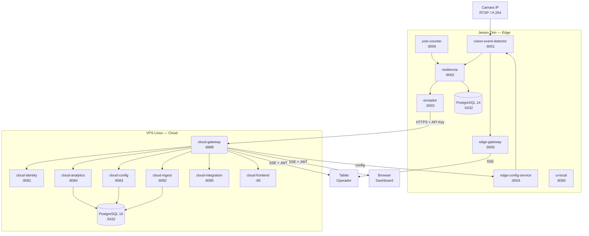

# INFORME TECNICO EJECUTIVO
## Sistema MENTOR EDGE — Plataforma de Monitoreo Industrial por Vision Artificial

**Fecha de elaboracion:** 20 de abril de 2026
**Version del documento:** 1.0
**Clasificacion:** Documento tecnico — auditoria de proyecto con financiamiento publico

---

## 1. Identificacion del Proyecto

| Campo | Detalle |
|---|---|
| Nombre del producto | MENTOR EDGE |
| Categoria | Plataforma industrial de monitoreo de produccion (OEE) |
| Tecnologia principal | Vision artificial + microservicios distribuidos |
| Periodo de desarrollo | 2024 - 2026 |
| Estado actual | En produccion activa |
| Cliente en produccion | Art Atlas S.A. (industria textil) |

---

## 2. Problema Resuelto

En la industria textil y manufacturera, la medicion del desempeno de lineas de produccion se realiza de forma manual o mediante sensores mecanicos sujetos a desgaste. Esto genera:

- Conteos de produccion inexactos y con latencia de horas o dias
- Registro tardio e impreciso de paradas de maquinaria
- Ausencia de metricas OEE (Overall Equipment Effectiveness) en tiempo real
- Imposibilidad de tomar decisiones correctivas durante el turno

MENTOR EDGE resuelve estos problemas reemplazando sensores fisicos y registros manuales con **una camara IP industrial por linea**, procesada en tiempo real por un dispositivo NVIDIA Jetson Orin mediante algoritmos de vision artificial.

---

## 3. Componentes Desarrollados

El sistema esta compuesto por tres subsistemas interdependientes, cada uno documentado en su propio informe tecnico:

| Componente | Documento | Descripcion |
|---|---|---|
| Edge (Jetson Orin) | DOC_01 | Deteccion en tiempo real, calculo OEE local, operacion offline |
| Cloud (VPS Linux) | DOC_02 | Gestion centralizada, dashboards, multi-tenancy, analitica |
| Tablet (Operador) | DOC_03 | App movil de operador: turnos, paradas, OEE en tiempo real |
| Arquitectura de Datos | DOC_04 | Modelo de BD por planta, flujo de datos, aislamiento por tenant |
| Resultados en Campo | DOC_05 | Metricas medidas en Art Atlas, costos, disponibilidad |

---

## 4. Objetivos Planteados vs. Cumplidos

| Objetivo | Estado | Evidencia |
|---|---|---|
| Detectar paso de unidades producidas sin contacto fisico con la linea | Cumplido | 4 lineas activas en Art Atlas con deteccion por camara IP |
| Calcular OEE (Disponibilidad, Rendimiento, Calidad) en tiempo real | Cumplido | Snapshots cada 30 segundos, visibles en dashboard cloud y tablet |
| Operar sin conexion a internet (offline-first) | Cumplido | Servicio `resiliencia` con buffer local de hasta 6 meses de datos |
| Soportar multiples clientes desde un servidor central (multi-tenant) | Cumplido | Arquitectura con BD por planta (`mentor_planta_XX`) |
| Proporcionar interfaz de operador en tablet | Cumplido | App Vue 3 + Capacitor desplegada en planta |
| Monitorear multiples lineas simultaneamente desde un Jetson | Cumplido | 4 lineas simultaneas con ~31% CPU por camara |
| Justificacion de paradas con jerarquia de categorias | Cumplido | Arbol de categorias configurable con hasta 3 niveles |
| Sincronizacion automatica Edge-Cloud con retry | Cumplido | Servicio `enviador` con retry exponencial y 6 goroutines paralelas |

---

## 5. Implementacion en Produccion — Art Atlas S.A.

### Datos de la instalacion

| Aspecto | Detalle |
|---|---|
| Cliente | Art Atlas S.A. |
| Sector | Industria textil |
| Lineas monitoreadas | 4 lineas de produccion simultaneas |
| Planta ID en sistema | Planta 14 |
| Dispositivo Edge | NVIDIA Jetson Orin Nano |
| IP del dispositivo | 192.168.100.31 |
| Servidor Cloud | VPS Linux, puerto 8888 |
| Fecha de puesta en marcha | 2025 |
| Estado | Operativo 24/7 |

### Servicios activos en produccion

| Capa | Servicios activos | Cantidad |
|---|---|---|
| Edge | vision-event-detector, resiliencia, enviador, edge-config-service, edge-gateway, yolo-counter, ui-local, PostgreSQL | 8 |
| Cloud | cloud-gateway, cloud-identity, cloud-ingest, cloud-config, cloud-analytics, cloud-integration, cloud-frontend, PostgreSQL | 8 |
| Tablet | mentor-tablet-app (Vue 3 + Capacitor) | 1 |

---

## 6. Arquitectura General del Sistema


TABLET OPERADOR
    |-- mentor-tablet-app      (Vue 3 + Capacitor)
         |-- Dashboard OEE en tiempo real
         |-- Gestion de paradas y justificaciones
         |-- Control de turnos
         |-- Historial de produccion
```

---

## 7. Estado Actual

- Sistema en operacion continua 24/7 en Art Atlas S.A.
- 4 lineas de produccion monitoreadas simultaneamente
- Sincronizacion automatica Edge-Cloud operativa
- Interfaz tablet activa para operadores de turno
- Dashboard cloud disponible para supervision remota
- Base de datos con particion por planta (`mentor_planta_14`)
- Infraestructura Docker desplegada tanto en Jetson como en VPS

---

## 8. Documentos Tecnicos de Respaldo

| Documento | Contenido |
|---|---|
| DOC_01_COMPONENTE_EDGE.md | Hardware, algoritmo de vision, servicios Edge, BD local |
| DOC_02_COMPONENTE_CLOUD.md | Microservicios, gateway, SSE, seguridad, frontend |
| DOC_03_COMPONENTE_TABLET.md | App operador, stores, rutas, comunicacion Edge/Cloud |
| DOC_04_ARQUITECTURA_DATOS.md | Modelo de datos, particion por planta, flujo dato |
| DOC_05_RESULTADOS_VALIDACION.md | Metricas medidas, costos, disponibilidad, ROI |
