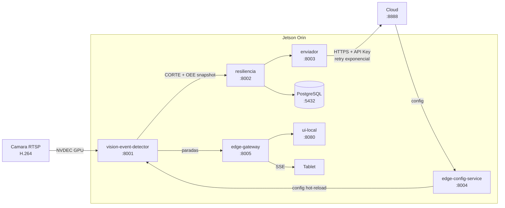
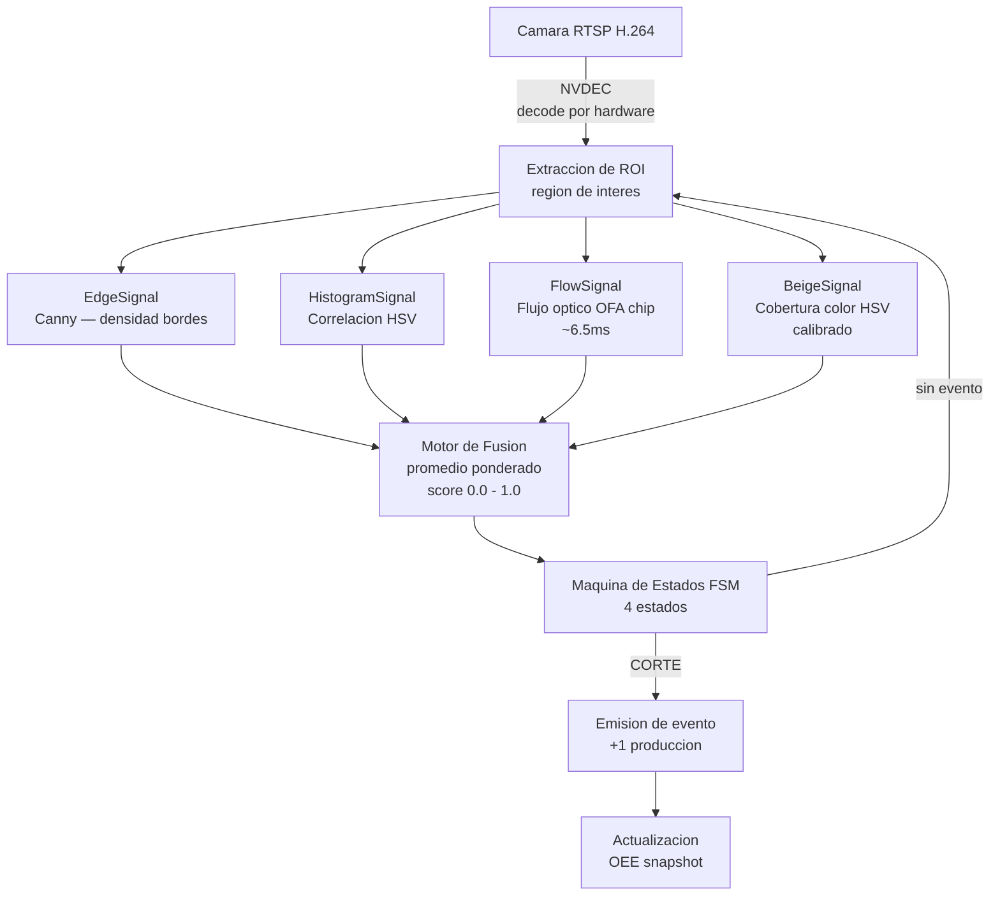
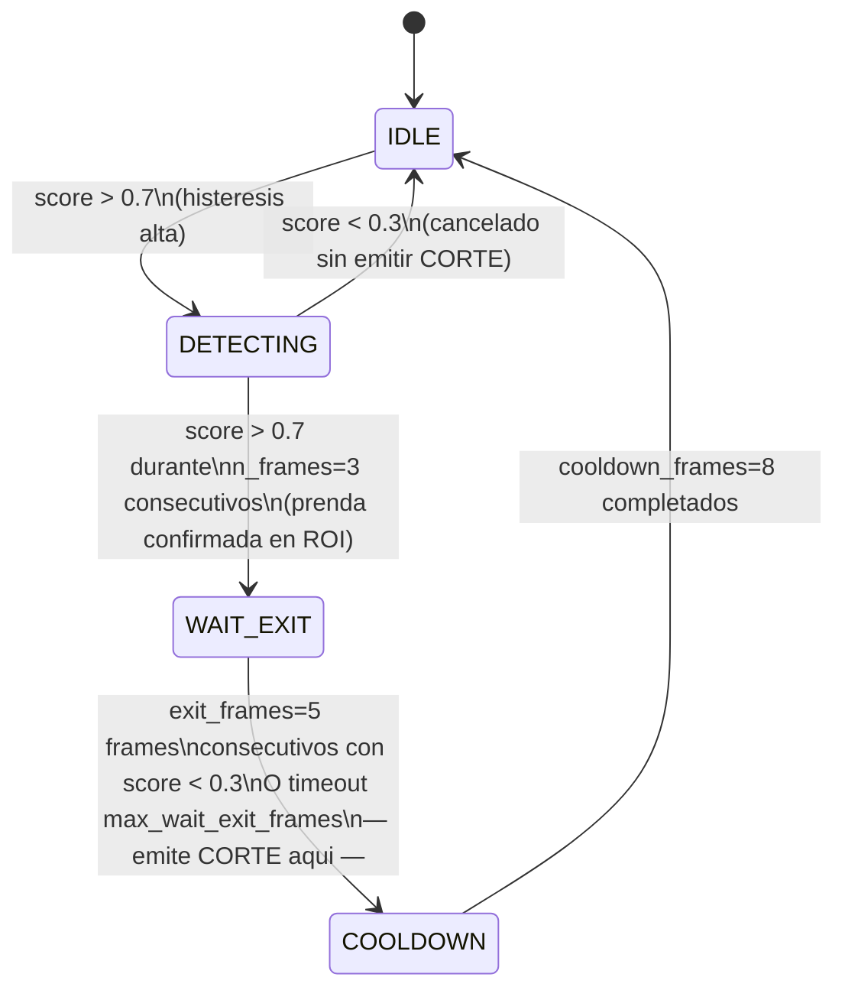

# DOCUMENTO TECNICO 01
## Componente Edge — Deteccion por Vision Artificial

**Proyecto:** MENTOR EDGE
**Version:** 2.0
**Fecha:** 20 de abril de 2026

---

## 1. Objetivo del Componente

El componente Edge es el nucleo de procesamiento en tiempo real del sistema. Ejecuta sobre un dispositivo NVIDIA Jetson Orin instalado en planta y realiza:

- Decodificacion acelerada por hardware del stream de video RTSP
- Deteccion del paso de unidades producidas mediante vision artificial
- Calculo local de OEE (Disponibilidad, Rendimiento, Calidad)
- Rastreo automatico de paradas de maquinaria
- Almacenamiento local offline-first con sincronizacion diferida al cloud

---

## 2. Hardware

### 2.1 Dispositivo de Procesamiento — NVIDIA Jetson Orin Nano

| Especificacion | Detalle |
|---|---|
| Modelo | NVIDIA Jetson Orin Nano 8GB |
| GPU | NVIDIA Ampere Architecture |
| Aceleradores dedicados | NVDEC (video H.264/H.265), OFA (flujo optico), VIC (conversion de color) |
| CPU | ARM Cortex-A78AE, 6 nucleos |
| RAM | 8 GB LPDDR5 |
| Almacenamiento | NVMe SSD 256 GB |
| Sistema operativo | JetPack 6.0 (Ubuntu 22.04 + CUDA + TensorRT) |
| Consumo electrico | 7W - 25W (configurable por modo de potencia) |
| Temperatura de operacion | -25 C a 80 C |
| Runtime de contenedores | Docker + Docker Compose |

### 2.2 Camara IP Industrial

| Especificacion | Detalle |
|---|---|
| Protocolo de transmision | RTSP sobre Ethernet |
| Resolucion | 1080p / 720p (configurable) |
| Framerate | 15-30 fps |
| Alimentacion | PoE (Power over Ethernet) |
| Proteccion | IP66 (resistente a polvo y agua) |
| Montaje | Soporte articulado sobre estructura de linea |

### 2.3 Instalacion en Art Atlas S.A.

| Parametro | Valor |
|---|---|
| Numero de Jetsons | 1 |
| Lineas monitoreadas | 4 (Maquina01, linea3, linea4, linea1) |
| Camaras activas | 4 |
| IP del dispositivo | 192.168.100.31 |
| Carga de CPU por camara | ~31% (con aceleracion GPU activa) |

---

## 3. Servicios Edge

El Edge ejecuta **8 servicios** orquestados con Docker Compose:

| Servicio | Puerto | Lenguaje | Responsabilidad |
|---|---|---|---|
| vision-event-detector | 8001 | Python 3.10 | Deteccion por vision, FSM, OEE snapshots, rastreo de paradas |
| resiliencia | 8002 | Go | Buffer local con deduplicacion, retencion 6 meses, purga automatica |
| enviador | 8003 | Go | Sincronizacion con cloud, retry exponencial, 6 goroutines paralelas |
| edge-config-service | 8004 | Go | CRUD de configuracion por linea, auto-versionamiento |
| edge-gateway | 8005 | Go | API REST unificada, SSE broker, proxy a servicios internos |
| yolo-counter | 8006 | Python | Conteo por YOLO v8 + TensorRT, correlacion de marca |
| ui-local | 8080 | Vue.js / Nginx | Interfaz web local para diagnostico y configuracion |
| PostgreSQL | 5432 | PostgreSQL 14 | Base de datos local con schemas `config` + `linea_{id}` |

### Flujo de datos entre servicios



---

## 4. Algoritmo de Deteccion por Vision Artificial

### 4.1 Arquitectura Hexagonal del vision-event-detector

```
app/
|-- adapters/
|   |-- opencv_adapter.py         # Captura RTSP via OpenCV
|   |-- gstreamer_adapter.py      # Captura RTSP via GStreamer NVDEC (GPU)
|   |-- config_client.py          # HTTP client a edge-config-service :8004
|   |-- http_event_adapter.py     # POST eventos a resiliencia :8002
|   |-- gateway_stop_client.py    # POST paradas a edge-gateway :8005
|   `-- cv_image_processor.py     # Transformaciones de imagen
|-- application/
|   `-- detector_service.py       # Orquestacion: frame -> senales -> FSM -> output
|-- domain/
|   |-- roi/roi_manager.py            # Extraccion de region de interes (ROI)
|   |-- signals/signal_extractors.py  # 4 extractores de senal
|   |-- fusion/fusion_engine.py       # Motor de fusion: 4 senales -> score 0-1
|   |-- fsm/event_fsm.py             # Maquina de estados (4 estados)
|   |-- oee/oee_aggregator.py        # Agregacion de OEE por ventanas de tiempo
|   |-- presence/presence_detector.py # Deteccion de presencia continua
|   |-- stop_tracker/stop_tracker.py  # Rastreo de paradas automaticas
|   |-- calibration/calibrator.py     # Calibracion automatica de umbrales
|   `-- watchdog/watchdog.py          # Monitoreo de salud de camara
`-- ports/
    |-- frame_input.py        # Interface para entrada de frames
    |-- config_port.py        # Interface para configuracion
    |-- event_output.py       # Interface para emision de eventos
    `-- image_processor.py    # Interface para procesamiento de imagen
```

### 4.2 Pipeline de Procesamiento por Frame

Cada frame del stream de video pasa por el siguiente pipeline:



### 4.3 Senales de Deteccion

| Senal | Metodo | Acelerador hardware | Fortaleza |
|---|---|---|---|
| EdgeSignal | Detector Canny sobre ROI | CPU (OpenCV) | Estable con productos de bordes definidos |
| HistogramSignal | Correlacion de histograma HSV entre frames | CPU | Deteccion de cambio de contenido |
| FlowSignal | Flujo optico de Lucas-Kanade | OFA chip (Jetson) | Independiente de iluminacion, latencia ~6.5ms |
| BeigeSignal | Cobertura de rango HSV calibrado | CPU | Especifica al color de la prenda |

**Parametros del BeigeSignal en produccion (Art Atlas — tela):**

| Canal HSV | Minimo | Maximo | Descripcion |
|---|---|---|---|
| Tono (H) | 12 | 50 | Rango naranja-amarillo |
| Saturacion (S) | 8 | 160 | Excluye grises y blancos |
| Brillo (V) | 100 | 255 | Excluye sombras |

### 4.4 Motor de Fusion — FusionEngine

Las 4 senales se fusionan en un score escalar `[0.0, 1.0]` mediante promedio ponderado. Los pesos cambian segun el modo de operacion configurado en `line_config.mode`:

```python
_TEXTIL_WEIGHTS = {
    'edge':  0.25,
    'color': 0.30,
    'flow':  0.35,
    'beige': 0.10,
}

_DEFAULT_WEIGHTS = {   # modo: botellas
    'edge':  0.30,
    'color': 0.25,
    'flow':  0.35,
    'beige': 0.10,
}
```

**Formula de fusion:**

$$score = edge \cdot w_e + color \cdot w_c + flow \cdot w_f + beige \cdot w_b$$

con la restriccion de que $\sum w_i = 1.0$.

**Flow gate:** Si `signals.flow < 0.5`, el score resultante es `0.0` independientemente de las demas senales. Esto previene falsos positivos cuando no hay movimiento real en el ROI:

```python
def fuse(self, signals: SignalValues) -> float:
    if signals.flow < self.flow_gate:
        return 0.0
    score = (
        signals.edge  * self.weights['edge']  +
        signals.color * self.weights['color'] +
        signals.flow  * self.weights['flow']  +
        signals.beige * self.weights['beige']
    )
    return min(1.0, max(0.0, score))
```

Art Atlas opera en modo `textil`. `flow` tiene el mayor peso (0.35) porque la deteccion de movimiento en el OFA chip es el indicador mas robusto del paso de tela.

### 4.5 Maquina de Estados Finitos (FSM)

La FSM tiene 4 estados y controla el ciclo de deteccion de una unidad. Los parametros reales del codigo son:

```python
@dataclass
class FSMConfig:
    n_frames:             int   = 3
    cooldown_frames:      int   = 8
    high_threshold:       float = 0.7
    low_threshold:        float = 0.3
    exit_frames:          int   = 5        # frames consecutivos bajos para confirmar salida
    max_wait_exit_frames: int   = 10000    # timeout de seguridad (~13 min @ 12.5fps)
    min_rearm_s:          float = 3.0      # tiempo minimo entre CORTEs (ciclo de pieza)
```



**Detalle critico:** El evento CORTE se emite en la **transicion de salida de WAIT_EXIT**, no en la entrada. Esto garantiza que la pieza haya pasado completamente por el ROI antes de contabilizarse. El detector espera a que el score caiga por debajo de `low_threshold` durante `exit_frames` frames consecutivos.

| Estado | Descripcion |
|---|---|
| IDLE | Sin prenda en ROI. Score esperado < 0.3. |
| DETECTING | Score supero 0.7. Acumulando frames consecutivos de confirmacion. |
| WAIT_EXIT | Prenda confirmada en ROI (n_frames=3 superado). Esperando que el score caiga (salida de prenda). |
| COOLDOWN | Anti-rebote post-CORTE. Bloquea nuevas detecciones durante 8 frames. |

**Parametro de seguridad `min_rearm_s`:** Si el tiempo entre el ultimo CORTE y el siguiente intento de CORTE es menor a 3.0 segundos, el intento se rechaza. Esto previene conteos multiples de la misma prenda en lineas de alta velocidad.

### 4.5 Deteccion de Paradas Automatica

El servicio `presence_detector` analiza una segunda ROI de movimiento con ventana deslizante lenta. Clasifica el estado de la maquina en:

| Estado | Condicion | Accion |
|---|---|---|
| Produciendo | Movimiento detectado en ROI de presencia | Registra tiempo de disponibilidad |
| Micro-parada | Sin movimiento < umbral de tiempo | Registra micro-parada (no justificable) |
| Parada | Sin movimiento >= umbral de tiempo | Genera evento de parada, notifica tablet |

---

## 5. Calculo de OEE Local

El `oee_aggregator` calcula las tres componentes del OEE por ventanas de tiempo configurables:

$$OEE = Disponibilidad \times Rendimiento \times Calidad$$

| Componente | Formula |
|---|---|
| Disponibilidad | Tiempo productivo / Tiempo planificado |
| Rendimiento | Unidades reales / (Velocidad nominal x Tiempo productivo) |
| Calidad | Unidades buenas / Unidades totales |

Los snapshots OEE se generan cada 30 segundos y se almacenan en la BD local antes de sincronizar con el cloud.

---

## 6. Resiliencia y Operacion Offline

El sistema garantiza operacion continua sin conexion al cloud mediante tres capas de software:

### 6.1 InMemoryDedup — Deduplicacion en memoria (servicio `resiliencia`)

```go
type InMemoryDedup struct {
    processed map[string]*list.Element  // eventID -> posicion LRU
    order     *list.List
    mu        sync.Mutex
    maxSize   int
}

func (d *InMemoryDedup) IsDuplicate(eventID string) bool {
    d.mu.Lock()
    defer d.mu.Unlock()
    if el, ok := d.processed[eventID]; ok {
        d.order.MoveToFront(el)
        return true
    }
    return false
}
```

Implementa un cache LRU thread-safe. Un evento duplicado (por reintento o reinicio parcial) es detectado en O(1) y descartado sin llegar a la BD. Al superar `maxSize`, evicta el elemento mas antiguo del `list.Back()`.

### 6.2 QueuePolicy — Tipos de evento y prioridades

```go
func (q *DefaultQueuePolicy) ShouldAccept(event *EventBuffer) bool {
    switch event.EventType {
    case "OEE_SNAPSHOT", "CORTE", "ANOMALIA", "CALIBRACION", "ENERGIA_SNAPSHOT":
        return true
    default:
        return false
    }
}

func (q *DefaultQueuePolicy) GetPriority(event *EventBuffer) int {
    switch event.EventType {
    case "OEE_SNAPSHOT":    return 0  // maxima prioridad
    case "CORTE":           return 1
    case "ANOMALIA":        return 2
    case "CALIBRACION":     return 3
    case "ENERGIA_SNAPSHOT": return 4
    default:                return 99
    }
}
```

### 6.3 RetryPolicy — Sincronizacion con cloud (servicio `enviador`)

```go
type RetryPolicy struct {
    InlineRetries:   3
    MaxEventRetries: 2880      // ~24h a 30s/intento
    InitialDelay:    2s
    MaxDelay:        2min
    BackoffFactor:   2.0
}

func (p *RetryPolicy) GetDelay(attemptNumber int) time.Duration {
    delay := float64(p.InitialDelay)
    for i := 0; i < attemptNumber; i++ {
        delay *= p.BackoffFactor
    }
    if time.Duration(delay) > p.MaxDelay {
        return p.MaxDelay
    }
    return time.Duration(delay)
}
```

$$delay_n = \min(2s \times 2.0^n,\ 120s)$$

Un evento con `retry_count >= 2880` se marca `dead = true` en BD. Queda disponible para auditoria sin ocupar ciclos de reintento.

### 6.4 SyncPolicy

```go
type SyncPolicy struct {
    BatchSize:    100   // eventos por request HTTPS
    PollInterval: 300   // segundos entre ciclos de sync
}
```

El `PollInterval` es ajustable en caliente sin reiniciar el servicio mediante `SetPollInterval(seconds)`. El minimo aceptado es 10 segundos.

### 6.5 Capacidad de almacenamiento offline

| Parametro | Valor |
|---|---|
| Retencion de eventos | 6 meses (`expires_at = NOW() + INTERVAL '6 months'`) |
| Capacidad maxima estimada | ~50M eventos (NVMe 256GB) |
| Purga automatica | Partial index `(expires_at) WHERE synced=true OR dead=true` |
| Arranque tras corte electrico | Sistema operativo en < 30s, servicios Docker en < 60s |

---

## 7. Configuracion en Caliente

El sistema soporta actualizacion de parametros sin reiniciar servicios (`hot-reload`). Los cambios se propagan desde el cloud via `edge-config-service` y se aplican en el siguiente ciclo del detector comparando `config_version`:

```sql
-- Cada UPDATE a line_config incrementa config_version automaticamente
CREATE OR REPLACE FUNCTION {schema}.update_config_timestamp()
RETURNS TRIGGER AS $$
BEGIN
    NEW.updated_at = NOW();
    NEW.config_version = OLD.config_version + 1;
    RETURN NEW;
END;
$$ LANGUAGE plpgsql;
```

El detector lee `config_version` en cada ciclo. Si cambio, deserializa el JSONB completo y reaplica todos los parametros. Si no cambio, omite la deserializacion.

**Parametros actualizables en caliente:**

| Campo JSONB | Contenido | Efecto |
|---|---|---|
| `thresholds` | high/low threshold, n_frames, exit_frames, cooldown, flow_gate | Ajusta sensibilidad de deteccion en tiempo real |
| `fsm` | max_wait_exit_frames, min_rearm_s | Parametros de timeout y anti-rebote |
| `roi` | x, y, width, height, roi_id | Reposiciona la ventana de deteccion |
| `oee` | micro_stop_max_s, stop_max_s, snapshot_interval_s | Cambia umbrales de clasificacion de paradas |
| `cloud` | sync_interval_s | Ajusta frecuencia de sincronizacion con cloud |
