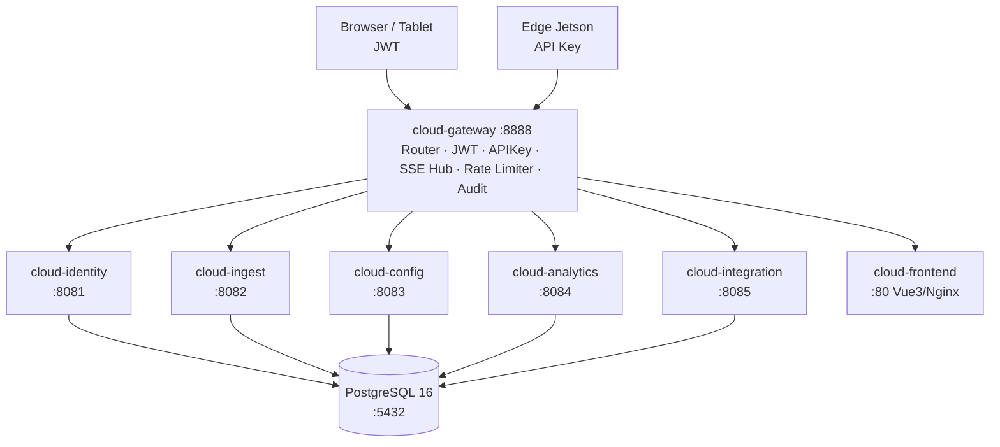
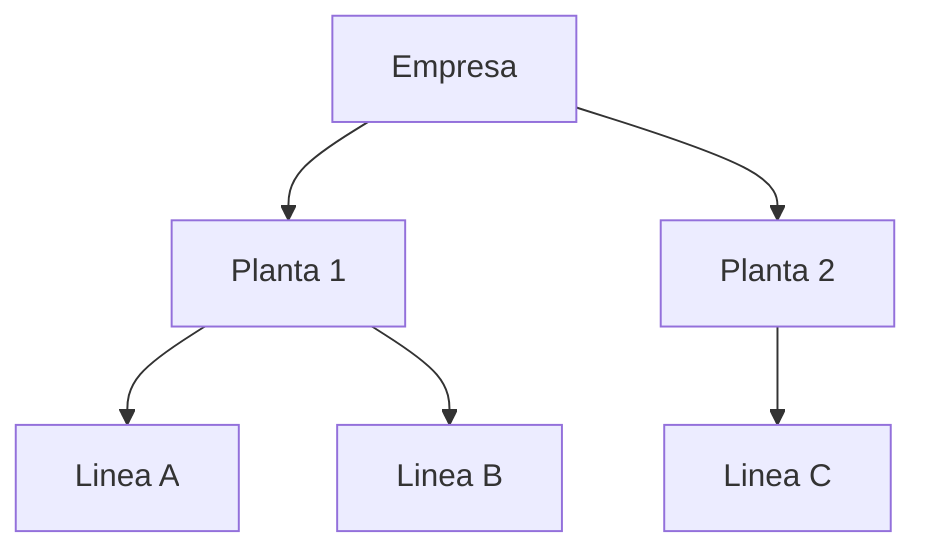

# DOCUMENTO TECNICO 02
## Componente Cloud — Plataforma de Gestion Centralizada

**Proyecto:** MENTOR EDGE
**Version:** 2.0
**Fecha:** 20 de abril de 2026

---

## 1. Objetivo del Componente

El componente Cloud es el centro de operaciones centralizado del sistema. Ejecuta sobre un servidor VPS Linux y provee:

- Gestion multi-tenant de empresas, plantas, lineas y dispositivos
- Ingesta y almacenamiento de datos OEE enviados por los Jetsons en planta
- Dashboards analiticos de OEE, Pareto de paradas y alarmas
- Autenticacion y control de acceso para usuarios y dispositivos
- Distribucion de configuracion hacia los dispositivos Edge
- Integraciones con APIs externas
- Frontend web (Vue 3) accesible desde navegador

---

## 2. Stack Tecnologico

| Componente | Tecnologia | Version |
|---|---|---|
| Lenguaje de microservicios | Go | 1.22 |
| Framework HTTP (mayoria) | Gin | v1.9 |
| Servicio gateway | Go net/http (nativo) | — |
| Base de datos | PostgreSQL | 16 |
| Orquestacion | Docker Compose | v2 |
| Frontend | Vue 3 + Nginx | Vue 3.4 |
| Monitoreo de infraestructura | Grafana + Prometheus | — |

---

## 3. Arquitectura de Microservicios

### 3.1 Diagrama de servicios



### 3.2 Inventario de servicios

| Servicio | Puerto | Responsabilidad principal |
|---|---|---|
| cloud-gateway | 8888 | Router central, autenticacion, SSE hub, rate limiting, audit log |
| cloud-identity | 8081 | Autenticacion JWT, usuarios, roles, empresas |
| cloud-ingest | 8082 | Ingesta de snapshots OEE y sincronizacion de paradas desde Edge |
| cloud-config | 8083 | Gestion de plantas, lineas, dispositivos, turnos, productos, categorias |
| cloud-analytics | 8084 | Dashboards OEE, Pareto, alarmas, compromisos, reportes |
| cloud-integration | 8085 | Claves API externas, consultas OEE/paradas para terceros |
| cloud-frontend | 80 | SPA Vue 3 servida via Nginx, proxy-pass desde gateway |

---

## 4. cloud-gateway — Router Central

### 4.1 Funcion

El gateway es el unico punto de entrada al sistema. Todas las solicitudes — tanto de navegadores como de dispositivos Jetson — pasan por el antes de ser enrutadas al microservicio correspondiente.

### 4.2 Middlewares implementados

La cadena de middleware del gateway se ejecuta en este orden por tipo de ruta:

```
CORS → RateLimit → [JWT | APIKey | InternalKey] → Handler
                                ↓
                        AuditLogger (goroutine asincrona)
```

| Middleware | Ruta aplicada | Funcion |
|---|---|---|
| CORS | Todas | Allow-Origin por lista de origenes configurados; preflight con `Max-Age: 43200` |
| JWT | `/api/*` (excepto `/api/auth/*`) | Valida HS256, extrae `sub`, `empresa_id`, `role`; inyecta en headers internos |
| JWTStream | `/api/v1/cloud/stream` | JWT con fallback `?token=` en query param (para `EventSource` del browser) |
| APIKey | `/api/v1/edge/*` | Valida `X-API-Key`; acepta global key o key por dispositivo; actualiza `last_seen_at` |
| InternalKey | `/internal/*` | Valida `X-Internal-Key` entre servicios; rechaza sin header |
| RateLimiter (Edge) | Rutas con APIKey | Token-bucket: cap=20, rate=10 tokens/s por `device_id` |
| RateLimiter (User) | Rutas con JWT | Token-bucket: cap=50, rate=20 tokens/s por `user_id` |
| AuditLogger | Todas | INSERT asincrono en `gateway.audit_log` |

**Implementacion del rate limiter (token-bucket):**

```go
type bucket struct {
    tokens   float64
    cap      float64
    rate     float64  // tokens por segundo
    lastFill time.Time
    mu       sync.Mutex
}

func (b *bucket) allow() bool {
    b.mu.Lock()
    defer b.mu.Unlock()
    now := time.Now()
    b.tokens += now.Sub(b.lastFill).Seconds() * b.rate
    b.lastFill = now
    if b.tokens > b.cap { b.tokens = b.cap }
    if b.tokens < 1 { return false }
    b.tokens--
    return true
}
```

Buckets inactivos por mas de 30 minutos se eliminan via goroutine de limpieza (`ticker = 10 min`).

### 4.3 Mapa de rutas

**Rutas Edge (autenticacion por API Key):**
```
POST  /api/v1/edge/*                --> cloud-ingest :8082
GET   /api/v1/edge/commands          --> comandos pendientes para el dispositivo
POST  /api/v1/edge/commands/:id      --> ACK de comando ejecutado
GET   /api/v1/edge/stream            --> SSE (actualizaciones en tiempo real)
GET   /api/v1/edge/linea-config      --> configuracion por linea
GET   /api/v1/edge/velocidad-nominal --> velocidades nominales actuales
```

**Rutas de usuario (JWT):**
```
POST  /api/auth/login      --> JWT access_token + refresh_token
POST  /api/auth/refresh    --> renovacion de access_token
POST  /api/auth/logout     --> revocacion de refresh token

GET   /api/v1/cloud/stream --> SSE en tiempo real (token en URL para EventSource)

GET/POST /api/plantas
GET/POST /api/lineas
GET/POST /api/dispositivos
GET/POST /api/variables
GET/POST /api/cat-paradas
GET      /api/arbol-paradas
GET/POST /api/turno-dias
GET/POST /api/canvas-oee

GET      /api/dashboard/*  --> cloud-analytics :8084
GET      /api/oee/*        --> cloud-analytics :8084
GET      /api/stops/*      --> cloud-analytics :8084
```

### 4.4 SSE Hub — Comunicacion en Tiempo Real

El gateway mantiene un hub de Server-Sent Events (SSE) que distribuye eventos en tiempo real a:

- **Browsers / Tablets cloud:** via `/api/v1/cloud/stream?token=JWT`
- **Dispositivos Edge:** via `/api/v1/edge/stream` (para recibir comandos y config)

Eventos transmitidos via SSE:

| Tipo de evento | Origen | Destino | Contenido |
|---|---|---|---|
| `oee_snapshot` | Edge (via ingest) | Browser | OEE actualizado en tiempo real |
| `stop_created` | Edge | Browser + Tablet | Nueva parada detectada |
| `stop_justified` | Tablet | Browser | Parada con categoria asignada |
| `command` | Cloud | Edge | Comando de configuracion o accion |
| `config_updated` | Cloud | Edge | Nueva configuracion publicada |

---

## 5. cloud-identity — Autenticacion y Control de Acceso

### 5.1 Modelo de autenticacion

| Actor | Mecanismo | Duracion |
|---|---|---|
| Usuario web / tablet | JWT (access_token + refresh_token) | access: 15min, refresh: 7 dias |
| Dispositivo Edge | API Key (X-API-Key) | Sin expiracion (revocable manualmente) |
| Comunicacion inter-servicio | Internal Key (X-Internal-Key) | Variable de entorno; no rotacion automatica |

**Estructura del JWT (claims):**

```json
{
  "sub":        123,          // usuario ID (int64)
  "empresa_id": 5,           // scope multi-tenant
  "role":       "operador",  // superadmin | admin_empresa | operador
  "exp":        1713916800,  // expiracion Unix timestamp
  "iat":        1713830400
}
```

El claim `empresa_id` es extraido por el middleware `JWT` e inyectado en el header interno `X-Empresa-ID`. Todos los microservicios downstream confian en este header — nunca en el body del request — para aplicar el filtro de tenant.

**Flujo de extraccion en middleware:**

```go
claims, ok := token.Claims.(jwt.MapClaims)
userID    := int64(asFloat(claims["sub"]))
empresaID := int64(asFloat(claims["empresa_id"]))
role, _   := claims["role"].(string)

r.Header.Set("X-User-ID",    strconv.FormatInt(userID, 10))
r.Header.Set("X-Empresa-ID", strconv.FormatInt(empresaID, 10))
r.Header.Set("X-Role",       role)
```

**Modelo de dominio de identidad:**

```go
type Usuario struct {
    ID           int
    Username     string
    Email        string
    PasswordHash string    // bcrypt; campo excluido de serialization JSON
    RolID        *int
    Rol          string
    EmpresaID    *int      // NULL = superadmin (acceso a todos los tenants)
    PlantaID     *int      // scope adicional a nivel planta
    Activo       bool
}

type RefreshToken struct {
    ID        string
    UsuarioID int
    TokenHash string    // SHA-256 del token plano; valor plano nunca persiste
    ExpiresAt time.Time
    Revocado  bool
}
```

### 5.2 Modelo de roles

| Rol | Permisos |
|---|---|
| superadmin | Acceso total al sistema, gestion de empresas |
| admin_empresa | Gestion de plantas, usuarios y configuracion de su empresa |
| operador | Solo puede ver y operar lineas asignadas |

### 5.3 Estructura de tenancy



Cada JWT incluye `empresa_id` y el `ScopeEnforcer` del gateway garantiza que un usuario solo acceda a datos de su empresa.

---

## 6. cloud-ingest — Ingesta desde Edge

Recibe y persiste los datos enviados por los dispositivos Jetson:

| Endpoint | Datos recibidos |
|---|---|
| `POST /api/v1/edge/oee` | Snapshots OEE (Disponibilidad, Rendimiento, Calidad, conteos) |
| `POST /api/v1/edge/stops-sync` | Sincronizacion de paradas registradas en Edge |
| `POST /api/v1/edge/events` | Eventos de produccion individuales (CORTE) |

Los datos se persisten en la base de datos de la planta correspondiente (`mentor_planta_XX`) en el schema de la linea (`linea_{id}`).

---

## 7. cloud-analytics — Analitica y Dashboards

Expone los datos calculados para consumo del frontend y APIs externas:

| Modulo | Descripcion |
|---|---|
| OEE historico | Consulta de metricas OEE por rango de fechas, turno, linea |
| Pareto de paradas | Ranking de causas de parada por frecuencia y duracion |
| Alarmas | Alertas configurables por umbral de OEE o duracion de parada |
| Compromisos | Registro de acciones correctivas sobre paradas |
| Reportes | Exportacion de datos por turno, dia, semana o mes |

---

## 8. Seguridad Implementada

| Mecanismo | Implementacion tecnica |
|---|---|
| Autenticacion usuarios | JWT HS256; access_token 15min; refresh_token 7 dias, hash SHA-256 en BD, revocable |
| Autenticacion dispositivos | `X-API-Key` por dispositivo; hash almacenado en `gateway.device_registry`; valor plano nunca persiste |
| Comunicacion inter-servicio | `X-Internal-Key` validada en gateway antes de enrutar a servicios internos |
| Aislamiento de datos | `empresa_id` extraido del JWT; inyectado como `X-Empresa-ID` en cada request downstream |
| Rate limiting | Token-bucket por `user_id`/`device_id`: Edge (cap=20, rate=10/s); User (cap=50, rate=20/s) |
| Audit log | `AuditEntry{Method, Path, Status, LatencyMs, IP, UserID, EmpresaID, DeviceID, Timestamp}` — INSERT asincrono |
| Transporte | HTTPS (TLS) en todas las comunicaciones externas; interno en red Docker privada |
| Passwords | bcrypt; campo `PasswordHash` excluido de todos los responses JSON via `json:"-"` |
| CORS | Lista de origenes permitidos configurada por variable de entorno; `Max-Age: 43200` para preflight |

---

## 9. Infraestructura Desplegada (Art Atlas)

| Recurso | Detalle |
|---|---|
| Tipo de servidor | VPS Linux |
| IP publica | 152.53.253.59 |
| Puerto externo | 8888 (cloud-gateway) |
| Orquestacion | Docker Compose |
| Base de datos | PostgreSQL 16 (contenedor Docker) |
| Frontend | Nginx (contenedor Docker) |
| BD central | mentor_cloud (identity, config, gateway, integration) |
| BD de planta | mentor_planta_14 (datos operativos de Art Atlas) |
| Esquemas por linea | linea_11 (Maquina01), linea_12 (linea3), linea_13 (linea4), linea_14 (linea1) |
