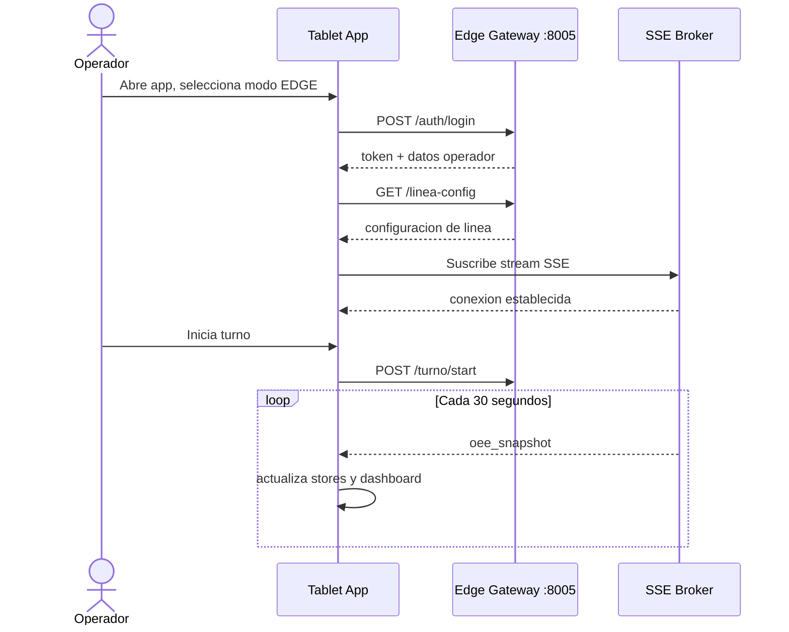
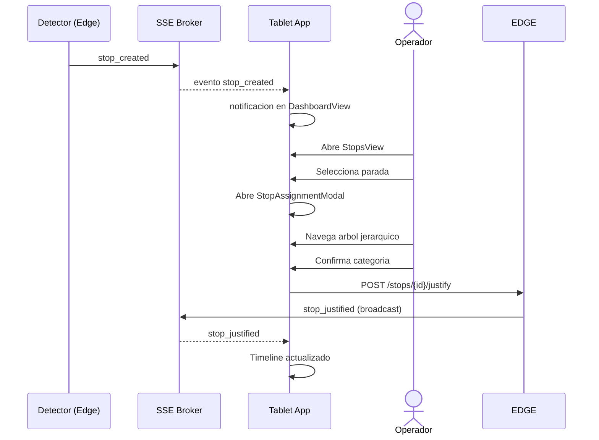
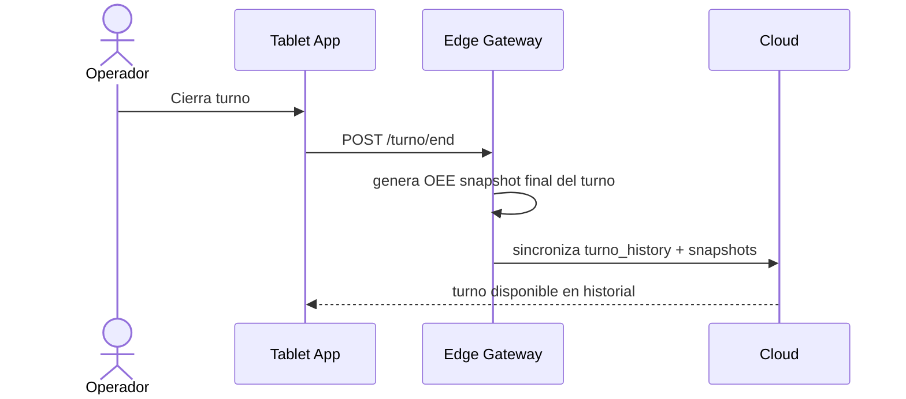

# DOCUMENTO TECNICO 03
## Componente Tablet — Aplicacion de Operador

**Proyecto:** MENTOR EDGE
**Version:** 1.0
**Fecha:** 20 de abril de 2026

---

## 1. Objetivo del Componente

La aplicacion tablet es la interfaz principal del operador de turno en planta. Permite:

- Visualizar el OEE y el estado de la linea en tiempo real
- Registrar y justificar paradas de maquinaria con jerarquia de categorias
- Gestionar turnos de produccion (inicio, fin, operador activo)
- Registrar defectos (merma) con cantidad y categoria
- Consultar el historial de paradas del turno o dias anteriores
- Configurar parametros del detector (ROI, umbrales, producto activo)
- Diagnosticar el estado de los servicios Edge

---

## 2. Stack Tecnologico

| Componente | Tecnologia | Version |
|---|---|---|
| Framework UI | Vue 3 (Composition API + script setup) | 3.4.21 |
| Gestion de estado | Pinia | 2.1.7 |
| Routing | Vue Router 4 | 4.3 |
| Estilos | Tailwind CSS con soporte dark mode | 3.4 |
| Build | Vite | — |
| Empaquetado movil | Capacitor 6 (iOS y Android) | 6.x |
| Comunicacion tiempo real | Server-Sent Events (SSE) | — |
| Libreria UI | Componentes custom (sin dependencia de UI library externa) | — |
| Lenguaje | TypeScript | — |

---

## 3. Modos de Conexion

La app opera en dos modos intercambiables:

| Modo | Conexion | Latencia tipica | Uso |
|---|---|---|---|
| EDGE | Directa al Jetson en la misma red local | 1 - 10 ms | Operador en planta |
| CLOUD | Al servidor central via internet | 100 - 500 ms | Supervision remota |

El modo HYBRID permite autenticacion cloud con fallback a Edge cuando la conexion cloud se pierde.

---

## 4. Estructura del Proyecto

```
mentor-tablet-app/
|-- src/
|   |-- App.vue                     # Root component + gestor de conexion
|   |-- main.ts                     # Entry point: Pinia + Router
|   |-- router/                     # 9 rutas con guards de autenticacion
|   |-- views/
|   |   |-- LoginView.vue           # Autenticacion edge / cloud
|   |   |-- DeviceSelectView.vue    # Descubrimiento de dispositivos edge
|   |   |-- DashboardView.vue       # Vista principal: timeline de produccion
|   |   |-- ProduccionView.vue      # Detector de vision en vivo
|   |   |-- StopsView.vue           # Lista y justificacion de paradas
|   |   |-- ConfigView.vue          # Configuracion ROI, umbrales, calibracion
|   |   |-- StatusView.vue          # Diagnostico de servicios y buffer
|   |   `-- HistorialView.vue       # Historial de paradas con busqueda
|   |-- components/
|   |   |-- TimelineCanvas.vue      # Rendering canvas del timeline de turno
|   |   |-- AppHeader.vue           # Barra superior con contadores OEE
|   |   |-- AppNav.vue              # Sidebar de navegacion
|   |   |-- StopAssignmentModal.vue # Selector jerarquico de categoria de parada
|   |   |-- ProductAssignmentModal.vue # Selector de producto activo
|   |   |-- MermaRegistrationModal.vue # Registro de defectos con cantidad
|   |   |-- CalendarModal.vue       # Navegacion por fecha en historial
|   |   |-- VelocidadNominalModal.vue  # Edicion de velocidad nominal
|   |   `-- StopForm.vue            # Formulario de creacion de parada manual
|   |-- stores/                     # 11 stores Pinia
|   |-- services/
|   |   |-- api.ts                  # Cliente HTTP dual (edge / cloud)
|   |   `-- sse.ts                  # Cliente SSE con auto-reconexion
|   |-- composables/
|   |   |-- useTimeline.ts          # Logica de timeline (800+ lineas)
|   |   `-- useThrottle.ts          # Rate limiting de llamadas
|   `-- types/
|       `-- index.ts                # Interfaces TypeScript del dominio
```

---

## 5. Rutas de la Aplicacion

| Ruta | Vista | Funcion | Requiere auth |
|---|---|---|---|
| `/` | — | Redirige a `/login` | No |
| `/login` | LoginView | Autenticacion edge o cloud | No |
| `/device` | DeviceSelectView | Seleccion manual de dispositivo edge | No |
| `/dashboard` | DashboardView | Timeline de produccion, OEE en vivo | Si |
| `/produccion` | ProduccionView | Detector de vision y FSM en tiempo real | Si |
| `/stops` | StopsView | Lista de paradas, asignacion de categoria | Si |
| `/config` | ConfigView | ROI, umbrales, calibracion, producto activo | Si |
| `/status` | StatusView | Diagnostico de servicios, estado del buffer | Si |
| `/historial` | HistorialView | Historial de paradas con filtro por fecha | Si |

---

## 6. Gestion de Estado (Pinia Stores)

La aplicacion cuenta con 11 stores Pinia que gestionan el estado global:

| Store | Responsabilidad principal |
|---|---|
| connection | Modo de conexion (EDGE/CLOUD/HYBRID/OFFLINE), URLs, autenticacion, SSE |
| oee | Metricas OEE en tiempo real (Disponibilidad, Rendimiento, Calidad, conteos) |
| stops | Lista de paradas activas, parada en justificacion, historial reciente |
| timeline | Datos del canvas de timeline: bloques de produccion y paradas por turno |
| turno | Turno activo, operador, hora de inicio, metadatos |
| products | Catalogo de productos y producto activo en la linea |
| categories | Arbol jerarquico de categorias de parada (hasta 3 niveles) |
| config | Configuracion del detector: ROI, umbrales, parametros FSM |
| devices | Dispositivos Edge disponibles en la red |
| merma | Registros de defectos del turno |
| status | Estado de salud de los servicios Edge (health checks) |

### Store de conexion — estados posibles

| Estado | Descripcion |
|---|---|
| EDGE | Conectado directamente al Jetson en la misma red |
| CLOUD | Conectado al servidor central, autenticado con JWT |
| HYBRID | Autenticado en cloud, con conexion directa al edge para baja latencia |
| OFFLINE | Sin conexion activa |

---

## 7. Comunicacion con Edge y Cloud

### 7.1 Cliente HTTP (api.ts)

El cliente HTTP detecta automaticamente si debe enrutar la llamada al Edge o al Cloud segun el modo de conexion activo. Agrega el header de autenticacion correspondiente:

- Modo EDGE: cabecera `X-API-Key`
- Modo CLOUD: cabecera `Authorization: Bearer {JWT}`

### 7.2 Cliente SSE (sse.ts)

Mantiene una conexion SSE persistente con reconexion automatica. Al recibir un evento:

1. Parsea el tipo de evento (`oee_snapshot`, `stop_created`, `command`, etc.)
2. Actualiza el store Pinia correspondiente
3. Los componentes Vue reaccionan automaticamente por reactividad

**Comportamiento ante perdida de conexion:**
- Reintento inmediato al primer fallo
- Backoff exponencial hasta maximo de 30 segundos
- Indicador visual de estado de conexion en `AppHeader`

---

## 8. Flujo Principal del Operador

### Inicio de turno



### Parada detectada y justificacion



### Fin de turno



---

## 9. Despliegue en Planta

La aplicacion se despliega de dos formas:

| Forma | Descripcion |
|---|---|
| Web en tablet | Acceso via navegador a `http://{IP_JETSON}:8080` (ui-local) |
| App nativa | Compilada con Capacitor para Android / iOS e instalada en tablet |

En Art Atlas S.A. la app se accede via navegador sobre la red local de la planta, conectandose directamente al Jetson Orin en la IP `192.168.100.31`.
