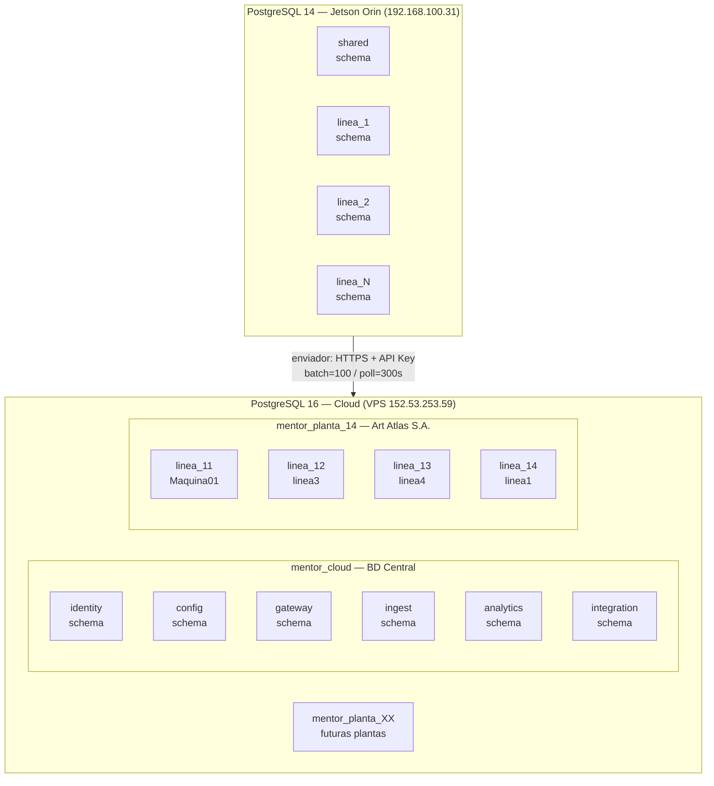
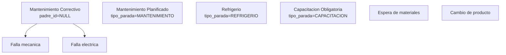
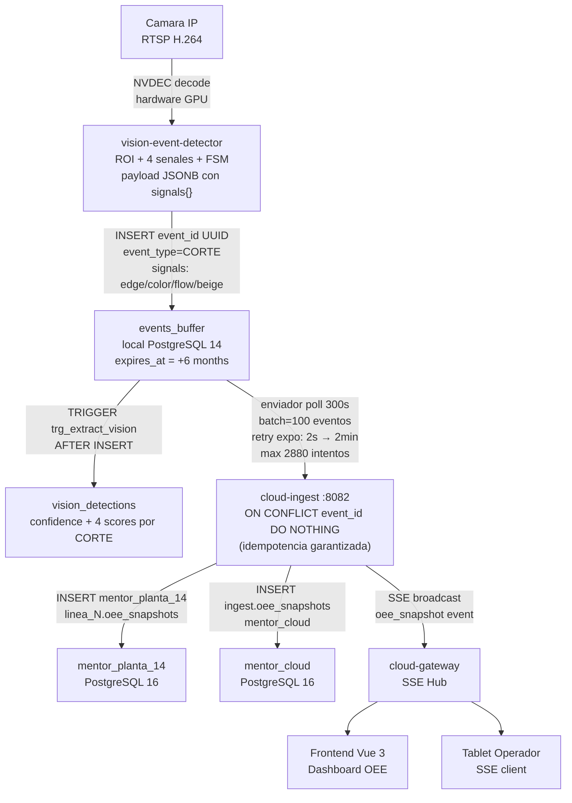

# DOCUMENTO TECNICO 04
## Arquitectura de Datos — Modelo de Base de Datos y Flujo de Informacion

**Proyecto:** MENTOR EDGE
**Version:** 2.0
**Fecha:** 20 de abril de 2026

---

## 1. Principios del Modelo de Datos

| Principio | Implementacion tecnica |
|---|---|
| Aislamiento por tenant | Base de datos PostgreSQL separada por planta (`mentor_planta_XX`). Una conexion de BD nunca cruza tenants. |
| Aislamiento logico cloud | Schema separado por dominio en `mentor_cloud`: `identity`, `config`, `ingest`, `analytics`, `gateway`, `integration` |
| Aislamiento por linea en edge | Schema `linea_{id}` dentro de la BD local del Jetson. Generado desde `linea_template.sql` via `sed` + `psql`. |
| Offline-first | El edge escribe primero en `events_buffer` local; el servicio `enviador` sincroniza de forma asincrona con retry exponencial. |
| Trazabilidad doble timestamp | `timestamp` = momento real del evento en el edge; `created_at` / `synced_at` = momento de ingesta en cloud. Permiten auditar latencias. |
| Idempotencia | Todos los eventos usan `UUID` como PK natural. Los inserts en cloud usan `ON CONFLICT (event_id) DO NOTHING`. |

---

## 2. Arquitectura de Bases de Datos

### 2.1 Vista global



### 2.2 Tenants activos en produccion

| Base de datos | Tipo | Cliente | Lineas activas | Creacion |
|---|---|---|---|---|
| `mentor_cloud` | BD central (compartida) | Todos los clientes | — | `init.sql` manual |
| `mentor_planta_14` | BD por planta | Art Atlas S.A. | linea_11, linea_12, linea_13, linea_14 | Migration `deploy-new-jetson.sh` |

---

## 3. Schema de BD Local del Edge — `linea_{id}`

Cada linea de produccion en el Jetson tiene su propio schema PostgreSQL generado desde `linea_template.sql`. El placeholder `{schema}` se reemplaza en deploy via:

```bash
sed 's/{schema}/linea_3/g' linea_template.sql | psql -U postgres -d mentor_edge
```

El schema contiene **10 grupos de tablas**:

### 3.1 Configuracion de linea — `line_config`

Una fila por `device_id`. Columnas clave son JSONB para permitir hot-reload sin ALTER TABLE:

```sql
CREATE TABLE {schema}.line_config (
    id              SERIAL PRIMARY KEY,
    device_id       VARCHAR(64) UNIQUE NOT NULL,
    config_version  INTEGER NOT NULL DEFAULT 1,
    roi             JSONB NOT NULL DEFAULT '{}',
    thresholds      JSONB NOT NULL DEFAULT '{}',
    fsm             JSONB NOT NULL DEFAULT '{}',
    mode            VARCHAR(16) NOT NULL DEFAULT 'textil',
    camera          JSONB,
    oee             JSONB NOT NULL DEFAULT '{
                        "line_name":"",
                        "micro_stop_max_s":210,
                        "stop_max_s":300,
                        "snapshot_interval_s":300
                    }',
    cloud           JSONB NOT NULL DEFAULT '{"sync_interval_s":300}',
    tablet          JSONB,
    created_at      TIMESTAMPTZ DEFAULT NOW(),
    updated_at      TIMESTAMPTZ DEFAULT NOW()
);
```

**Trigger de auto-versionamiento:** Cada UPDATE incrementa `config_version` automaticamente:

```sql
CREATE OR REPLACE FUNCTION {schema}.update_config_timestamp()
RETURNS TRIGGER AS $$
BEGIN
    NEW.updated_at = NOW();
    NEW.config_version = OLD.config_version + 1;
    RETURN NEW;
END;
$$ LANGUAGE plpgsql;

CREATE TRIGGER config_update_trigger
BEFORE UPDATE ON {schema}.line_config
FOR EACH ROW
EXECUTE FUNCTION {schema}.update_config_timestamp();
```

Esto permite que el detector verifique si la config cambio comparando solo el entero `config_version` sin deserializar el JSONB completo.

### 3.2 Buffer de eventos de produccion — `events_buffer`

Tabla central del patron offline-first. Todo evento generado por el detector se escribe aqui antes de ser enviado al cloud:

```sql
CREATE TABLE {schema}.events_buffer (
    id          BIGSERIAL  PRIMARY KEY,
    event_id    UUID UNIQUE NOT NULL,
    device_id   VARCHAR(100),
    event_type  VARCHAR(32) NOT NULL,
    timestamp   TIMESTAMPTZ NOT NULL,
    payload     JSONB NOT NULL DEFAULT '{}',
    synced      BOOLEAN DEFAULT FALSE,
    dead        BOOLEAN DEFAULT FALSE,
    retry_count INTEGER DEFAULT 0,
    created_at  TIMESTAMPTZ DEFAULT NOW(),
    synced_at   TIMESTAMPTZ,
    expires_at  TIMESTAMPTZ DEFAULT (NOW() + INTERVAL '6 months')
);
```

**Indices de rendimiento:**

```sql
-- Lectura de pendientes (ruta critica del enviador)
CREATE INDEX idx_{schema}_events_pending
    ON {schema}.events_buffer (timestamp ASC)
    WHERE synced = false AND dead = false;

-- Consulta para purga de expirados
CREATE INDEX idx_{schema}_events_expiry
    ON {schema}.events_buffer (expires_at)
    WHERE synced = true OR dead = true;
```

**Autovacuum agresivo** (tabla de alta frecuencia de escritura):
```sql
ALTER TABLE {schema}.events_buffer SET (autovacuum_vacuum_scale_factor = 0.05);
ALTER TABLE {schema}.events_buffer SET (autovacuum_analyze_scale_factor = 0.02);
```

**Tipos de evento aceptados** (definidos en `QueuePolicy`):

| Tipo de evento | Prioridad de envio | Descripcion |
|---|---|---|
| `OEE_SNAPSHOT` | 0 (maxima) | Snapshot OEE calculado cada 30s |
| `CORTE` | 1 | Deteccion de paso de unidad producida |
| `ANOMALIA` | 2 | Anomalia detectada por watchdog |
| `CALIBRACION` | 3 | Resultado de calibracion automatica |
| `ENERGIA_SNAPSHOT` | 4 | Lectura de consumo electrico |

### 3.3 Detecciones de vision — `vision_detections`

Tabla especializada para registrar los scores de cada deteccion CORTE con sus 4 senales independientes. Se **puebla automaticamente via trigger** sobre `events_buffer`:

```sql
CREATE TABLE {schema}.vision_detections (
    id           BIGSERIAL   PRIMARY KEY,
    detection_id UUID        NOT NULL,
    detected_at  TIMESTAMPTZ NOT NULL,
    line_code    VARCHAR(64),
    confidence   REAL,
    signal_edge  REAL,
    signal_color REAL,
    signal_flow  REAL,
    signal_beige REAL,
    roi_id       VARCHAR(32),
    CONSTRAINT {schema}_vision_det_uq UNIQUE (detection_id)
);
```

**Trigger que extrae las 4 senales del payload JSONB en cada INSERT de evento tipo CORTE:**

```sql
CREATE OR REPLACE FUNCTION {schema}.extract_vision_detection()
RETURNS TRIGGER AS $$
BEGIN
    IF NEW.event_type <> 'CORTE' THEN RETURN NEW; END IF;
    INSERT INTO {schema}.vision_detections (
        detection_id, detected_at, line_code,
        confidence, signal_edge, signal_color, signal_flow, signal_beige, roi_id
    ) VALUES (
        NEW.event_id, NEW.timestamp,
        NEW.payload ->> 'line_code',
        (NEW.payload ->> 'confidence')::REAL,
        (NEW.payload -> 'signals' ->> 'edge')::REAL,
        (NEW.payload -> 'signals' ->> 'color')::REAL,
        (NEW.payload -> 'signals' ->> 'flow')::REAL,
        (NEW.payload -> 'signals' ->> 'beige')::REAL,
        NEW.payload ->> 'roi_id'
    )
    ON CONFLICT (detection_id) DO NOTHING;
    RETURN NEW;
END;
$$ LANGUAGE plpgsql;

CREATE TRIGGER trg_{schema}_extract_vision
AFTER INSERT ON {schema}.events_buffer
FOR EACH ROW EXECUTE FUNCTION {schema}.extract_vision_detection();
```

Esto permite consultas de analitica sobre la calidad de las senales de vision por periodo sin deserializar JSONB.

### 3.4 Paradas — `stops`

```sql
CREATE TABLE {schema}.stops (
    id              BIGSERIAL  PRIMARY KEY,
    stop_id         UUID UNIQUE NOT NULL DEFAULT uuid_generate_v4(),
    device_id       VARCHAR(64) NOT NULL DEFAULT '',
    stop_type       VARCHAR(32) NOT NULL DEFAULT 'PARADA_NO_ASIGNADA',
    started_at      TIMESTAMPTZ NOT NULL,
    ended_at        TIMESTAMPTZ,
    duration_ms     INTEGER,
    justified       BOOLEAN NOT NULL DEFAULT FALSE,
    reason          TEXT,
    category        VARCHAR(64),
    categoria_id    INTEGER,
    justified_by    VARCHAR(128),
    justified_at    TIMESTAMPTZ,
    source          VARCHAR(32) NOT NULL DEFAULT 'detector',
    synced          BOOLEAN DEFAULT FALSE,
    synced_at       TIMESTAMPTZ,

    CONSTRAINT chk_{schema}_stop_type CHECK (stop_type IN (
        'MICROPARADA', 'PARADA_NO_ASIGNADA', 'PROGRAMADA', 'NO_PROGRAMADA',
        'MECANICA', 'ELECTRICA', 'CAMBIO_FORMATO',
        'FALTA_MATERIAL', 'CALIDAD', 'REFRIGERIO',
        'CAPACITACION', 'MANTENIMIENTO', 'OTRA'
    ))
);
```

**Trigger de calculo automatico de duracion:**

```sql
CREATE OR REPLACE FUNCTION {schema}.update_stop_duration()
RETURNS TRIGGER AS $$
BEGIN
    IF NEW.ended_at IS NOT NULL AND OLD.ended_at IS NULL THEN
        NEW.duration_ms = EXTRACT(EPOCH FROM (NEW.ended_at - NEW.started_at)) * 1000;
    END IF;
    NEW.updated_at = NOW();
    RETURN NEW;
END;
$$ LANGUAGE plpgsql;

CREATE TRIGGER trg_{schema}_stop_duration
BEFORE UPDATE ON {schema}.stops
FOR EACH ROW
EXECUTE FUNCTION {schema}.update_stop_duration();
```

`duration_ms` se calcula en el momento en que el operador cierra la parada. No requiere calculo en capa de aplicacion.

**Indices optimizados:**

```sql
-- Paradas abiertas (sin ended_at): consulta del dashboard en vivo
CREATE INDEX idx_{schema}_stops_open
    ON {schema}.stops (started_at)
    WHERE ended_at IS NULL;

-- Paradas sin justificar: consulta principal de la tablet
CREATE INDEX idx_{schema}_stops_unjustified
    ON {schema}.stops (started_at DESC)
    WHERE justified = false AND ended_at IS NOT NULL;
```

### 3.5 OEE Snapshots — `oee_snapshots`

```sql
CREATE TABLE {schema}.oee_snapshots (
    id             BIGSERIAL PRIMARY KEY,
    device_id      VARCHAR(100),
    turno          VARCHAR(50),
    fecha          DATE        NOT NULL,
    hora           TIMESTAMPTZ NOT NULL,
    disponibilidad NUMERIC(5,2),
    rendimiento    NUMERIC(5,2),
    calidad        NUMERIC(5,2),
    oee            NUMERIC(5,2),
    produccion     INT DEFAULT 0,
    energia_kwh    NUMERIC(10,3) DEFAULT 0,
    code           VARCHAR(50),
    interval_s     INT,
    head           TEXT[],
    data           BIGINT[],
    creado_en      TIMESTAMPTZ NOT NULL DEFAULT NOW()
);

CREATE INDEX idx_{schema}_oee_fecha ON {schema}.oee_snapshots (fecha DESC, interval_s);
CREATE INDEX idx_{schema}_oee_hora  ON {schema}.oee_snapshots (hora DESC);
```

Los campos `head` (array de nombres de variable) y `data` (array de valores) permiten almacenar las variables OEE dinamicas sin esquema fijo, usando la clave `(device_id, code, interval_s)` para identificar el tipo de snapshot.

### 3.6 Production Runs — `production_runs`

```sql
CREATE TABLE {schema}.production_runs (
    id          BIGSERIAL PRIMARY KEY,
    run_id      UUID NOT NULL DEFAULT uuid_generate_v4(),
    device_id   VARCHAR(100) NOT NULL DEFAULT '',
    linea_id    INTEGER,
    producto_id INTEGER,
    sku         VARCHAR(64),
    nombre      TEXT,
    started_at  TIMESTAMPTZ NOT NULL,
    ended_at    TIMESTAMPTZ,
    synced      BOOLEAN DEFAULT FALSE,
    synced_at   TIMESTAMPTZ
);

CREATE INDEX idx_{schema}_run_pending
    ON {schema}.production_runs (synced)
    WHERE synced = false;
```

Cada cambio de producto o inicio de turno crea un nuevo `production_run`. El OEE se calcula siempre dentro de los limites de un run activo.

### 3.7 Comandos del cloud — `commands_buffer`

```sql
CREATE TABLE {schema}.commands_buffer (
    id              SERIAL PRIMARY KEY,
    command_id      UUID UNIQUE NOT NULL,
    device_id       VARCHAR(64) NOT NULL,
    command_type    VARCHAR(64) NOT NULL,
    payload         JSONB NOT NULL DEFAULT '{}',
    status          VARCHAR(16) NOT NULL DEFAULT 'RECEIVED',
    issued_by       VARCHAR(128),
    issued_at       TIMESTAMPTZ DEFAULT NOW(),
    idempotency_key VARCHAR(255),
    result          JSONB,
    error_message   TEXT,
    applied_at      TIMESTAMPTZ,

    CONSTRAINT chk_{schema}_cmd_status CHECK (
        status IN ('RECEIVED','APPLIED','FAILED')
    )
);

-- Indice partial: garantiza idempotencia solo donde la clave existe
CREATE UNIQUE INDEX idx_{schema}_cmd_idempotency
    ON {schema}.commands_buffer (idempotency_key)
    WHERE idempotency_key IS NOT NULL;

-- Consulta de comandos pendientes por dispositivo
CREATE INDEX idx_{schema}_commands_device
    ON {schema}.commands_buffer (device_id, issued_at DESC);
```

Un comando reenviado con el mismo `idempotency_key` es rechazado en BD antes de llegar a la capa de aplicacion.

### 3.8 Tablas de auditoria y salud

```sql
CREATE TABLE {schema}.audit_log (
    id          BIGSERIAL PRIMARY KEY,
    device_id   VARCHAR(64),
    actor       VARCHAR(128),
    action      VARCHAR(64) NOT NULL,
    resource    VARCHAR(64),
    resource_id VARCHAR(128),
    payload     JSONB,
    result      VARCHAR(32),
    timestamp   TIMESTAMPTZ DEFAULT NOW()
);

-- autovacuum agresivo (alta frecuencia de inserts)
ALTER TABLE {schema}.audit_log SET (autovacuum_vacuum_scale_factor = 0.1);

CREATE TABLE {schema}.health_logs (
    id        SERIAL PRIMARY KEY,
    service   VARCHAR(64) NOT NULL,
    status    VARCHAR(16) NOT NULL,
    metrics   JSONB,
    errors    JSONB,
    timestamp TIMESTAMPTZ DEFAULT NOW()
);

CREATE INDEX idx_{schema}_health_svc_ts ON {schema}.health_logs (service, timestamp);
```

---

## 4. Schema Compartido del Edge — `shared`

El schema `shared` almacena datos comunes a todas las lineas del Jetson: catalogos sincronizados desde el cloud, configuracion global y registros de salud.

### 4.1 Catalogos replicados desde cloud

```sql
-- Replica de config.categoria_paradas (cloud)
CREATE TABLE shared.cat_programada (
    id        SERIAL PRIMARY KEY,
    codigo    TEXT NOT NULL,
    nombre    VARCHAR(200) NOT NULL,
    padre_id  INT REFERENCES shared.cat_programada(id) ON DELETE SET NULL,
    orden     INT NOT NULL DEFAULT 0,
    activo    BOOLEAN NOT NULL DEFAULT TRUE,
    synced_at TIMESTAMPTZ NOT NULL DEFAULT NOW()
);

-- La PK usa el ID del cloud (no auto-incremental) para UPSERT deterministico
CREATE TABLE shared.sync_productos (
    id         INTEGER PRIMARY KEY,
    codigo     VARCHAR(50) NOT NULL,
    nombre     VARCHAR(100) NOT NULL,
    empresa_id INTEGER,
    activo     BOOLEAN NOT NULL DEFAULT TRUE,
    synced_at  TIMESTAMPTZ NOT NULL DEFAULT NOW()
);

CREATE TABLE shared.sync_turnos (
    id          INTEGER PRIMARY KEY,
    nombre      VARCHAR(100) NOT NULL,
    hora_inicio VARCHAR(20) NOT NULL,
    hora_fin    VARCHAR(20) NOT NULL,
    planta_id   INTEGER,
    activo      BOOLEAN NOT NULL DEFAULT TRUE,
    synced_at   TIMESTAMPTZ NOT NULL DEFAULT NOW()
);
```

El edge puede operar con estos datos sin conectividad a internet. El servicio `edge-config-service` actualiza los catalogos cada vez que recupera conexion.

---

## 5. Politica de Sincronizacion — Servicio `enviador`

El servicio `enviador` implementa las siguientes politicas como objetos de dominio en Go:

### 5.1 RetryPolicy

```go
type RetryPolicy struct {
    InlineRetries   int           // 3  — reintentos inmediatos ante fallo HTTP 5xx
    MaxEventRetries int           // 2880 — maximo total (~24h a 30s/intento)
    InitialDelay    time.Duration // 2s
    MaxDelay        time.Duration // 2 minutos
    BackoffFactor   float64       // 2.0 (exponencial)
}
```

Calculo del delay por intento:

$$delay_n = \min(InitialDelay \times BackoffFactor^n,\ MaxDelay)$$

| Intento | Delay |
|---|---|
| 0 | 2s |
| 1 | 4s |
| 2 | 8s |
| 3 | 16s |
| 4 | 32s |
| 5 | 64s |
| 6+ | 120s (capped) |

Un evento con `retry_count >= 2880` se marca `dead = true` y se excluye permanentemente de envios. Queda en BD para auditoria.

### 5.2 SyncPolicy

```go
type SyncPolicy struct {
    BatchSize    int // 100 — eventos por request HTTP
    PollInterval int // 300s — ciclo de sincronizacion
}

// PollInterval es ajustable en caliente (minimo 10s)
func (p *SyncPolicy) SetPollInterval(seconds int) {
    if seconds >= 10 {
        p.PollInterval = seconds
    }
}
```

### 5.3 Deduplicacion — InMemoryDedup

El servicio `resiliencia` implementa deduplicacion en memoria con estructura LRU para evitar reenviar eventos duplicados ante reconexiones o reinicios parciales:

```go
type InMemoryDedup struct {
    processed map[string]*list.Element  // eventID -> posicion en lista
    order     *list.List                 // lista para orden LRU
    mu        sync.Mutex                 // thread-safe
    maxSize   int
}
```

- `IsDuplicate(eventID)`: O(1) lookup en map + MoveToFront en lista
- `MarkProcessed(eventID)`: inserta y evicta el elemento mas antiguo si `len >= maxSize`
- Eviccion LRU: elimina el elemento `Back()` de la lista y su entrada en el map

---

## 6. Arbol de Categorias de Parada — Art Atlas

Configurado en `config.categoria_paradas` del cloud y replicado en `shared.cat_programada` del edge para operacion offline:



Las categorias con `tipo_parada` especifico son **obligatorias** — creadas por la migration `04_seed_obligatory_categories.sql` de forma idempotente. No pueden eliminarse desde la UI del cloud.

---

## 7. Schema de la BD Central — `mentor_cloud`

### 7.1 Schema: config

```
config.empresas
    └── config.plantas (empresa_id FK)
            └── config.lineas (planta_id FK)
                    └── config.dispositivos (linea_id FK)
                            └── config.variables (dispositivo_id FK)

config.productos (empresa_id)
config.turno_dias (linea_id)
config.categoria_paradas (linea_id, padre_id self-ref)
config.canvas_oee (linea_id)
```

**Variables OEE registradas por dispositivo (`config.variables`):**

| Clave | Descripcion |
|---|---|
| `T_DISPONIBLE` | Tiempo total disponible del turno (segundos) |
| `T_MICROPARADA` | Tiempo en micro-paradas (stop_type=MICROPARADA, < 120s) |
| `T_PARADA_NO_ASIGNADA` | Tiempo en paradas pendientes de justificacion |
| `CONTEO_1` | Unidades contadas por vision artificial (BeigeSignal) |
| `T_CAPACITACION_OBLIGATORIA` | Tiempo en paradas tipo `CAPACITACION` |
| `T_MANTENIMIENTO_PLANIFICADO` | Tiempo en paradas tipo `MANTENIMIENTO` |
| `T_PARADA_NO_PROGRAMADA` | Tiempo en paradas no planificadas |

### 7.2 Schema: ingest

```sql
-- Snapshot OEE (90% del trafico de ingesta)
ingest.oee_snapshots (
    empresa_id, planta_id, linea_id,
    fecha DATE, hora TIMESTAMPTZ,
    disponibilidad, rendimiento, calidad, oee  -- NUMERIC(5,2)
    produccion INT, interval_s INT,
    head TEXT[], data BIGINT[]                  -- variables dinamicas
)

-- Eventos raw (trazabilidad completa)
ingest.raw_events (
    empresa_id, linea_id,
    event_type VARCHAR(32),
    timestamp_edge  TIMESTAMPTZ,    -- momento en el Jetson
    timestamp_ingest TIMESTAMPTZ,   -- momento de llegada al cloud
    payload JSONB
)
```

**Indices de rendimiento (migration 06):**

```sql
-- Cubre 90% de queries del dashboard (multi-tenant por linea)
CREATE INDEX idx_ingest_oee_empresa_linea
    ON ingest.oee_snapshots(empresa_id, linea_id, fecha DESC);

-- Series temporales intra-dia
CREATE INDEX idx_ingest_oee_hora
    ON ingest.oee_snapshots(hora DESC);

-- Auditoria: por empresa y tiempo
CREATE INDEX idx_ingest_raw_empresa_ts
    ON ingest.raw_events(empresa_id, timestamp_edge DESC);

-- Por tipo de evento
CREATE INDEX idx_ingest_raw_linea_type
    ON ingest.raw_events(linea_id, event_type, timestamp_edge DESC);
```

### 7.3 Schema: gateway

```sql
-- Dispositivos registrados
gateway.device_registry (
    device_id     VARCHAR(64) PK,
    planta_id     INT,
    linea_id      INT,
    api_key_hash  VARCHAR(255),  -- nunca el valor plano
    last_seen     TIMESTAMPTZ
)

-- Cola de comandos hacia dispositivos
gateway.commands (
    command_id      UUID PK,
    device_id       VARCHAR(64),
    command_type    VARCHAR(64),
    payload         JSONB,
    status          VARCHAR(16),  -- pending / sent / acked / failed
    issued_by       VARCHAR(128),
    idempotency_key VARCHAR(255) UNIQUE
)

-- Audit log de todos los requests HTTP
gateway.audit_log (
    actor        VARCHAR(128),   -- user_id o device_id
    ip           INET,
    method       VARCHAR(8),
    path         TEXT,
    status_code  INT,
    latency_ms   INT,
    timestamp    TIMESTAMPTZ
)
```

---

## 8. Flujo del Dato — De la Camara al Dashboard



---

## 9. Politica de Retencion y Purga

| Nivel | Tabla | Retencion | Mecanismo |
|---|---|---|---|
| Edge local | `events_buffer` | 6 meses | `expires_at = NOW() + INTERVAL '6 months'`; partial index `(expires_at) WHERE synced=true OR dead=true` |
| Edge local | `stops` | 6 meses | Mismo mecanismo |
| Edge local | `health_logs` | 30 dias | Purga por volumen en job periodico |
| Cloud ingest | `ingest.oee_snapshots` | Indefinido | Sin purga automatica |
| Cloud gateway | `gateway.audit_log` | Configurable | `autovacuum_vacuum_scale_factor = 0.1` |

---

## 10. Aislamiento y Seguridad de Datos

| Mecanismo | Implementacion tecnica |
|---|---|
| BD por planta | Una query en `cloud-analytics` especifica la BD de la planta en la cadena de conexion. Imposible cruce entre tenants a nivel BD. |
| `empresa_id` en JWT | El JWT incluye `empresa_id` en el claim. El `ScopeEnforcer` del gateway inyecta `X-Empresa-ID` como header interno. |
| Row-level filtering | Todos los servicios aplican `WHERE empresa_id = $claim_empresa_id` antes de cualquier SELECT. |
| API Key hasheada | `X-API-Key` del Jetson se almacena como hash en `gateway.device_registry`. El texto plano nunca persiste en BD. |
| Idempotencia de comandos | `commands_buffer.idempotency_key` tiene UNIQUE INDEX partial. Un comando reenviado no se ejecuta dos veces. |
| Audit de latencia | `timestamp_edge` vs `timestamp_ingest` en `raw_events`: si `timestamp_ingest < timestamp_edge`, el sistema detecta anomalia de reloj o manipulacion. |
