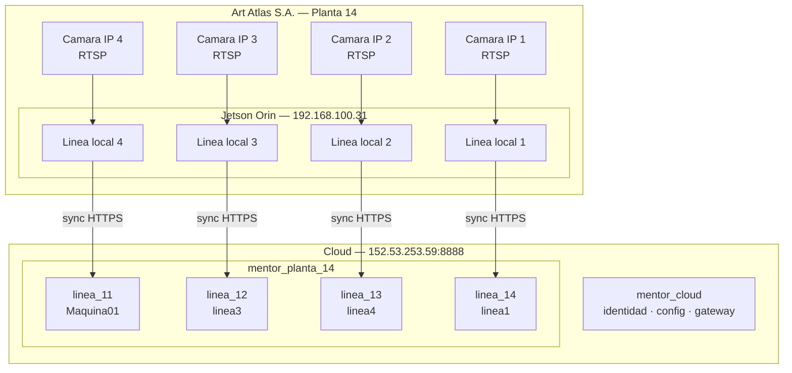

# DOCUMENTO TECNICO 05
## Resultados y Validacion en Campo — Art Atlas S.A.

**Proyecto:** MENTOR EDGE
**Version:** 1.0
**Fecha:** 20 de abril de 2026

---

## 1. Descripcion del Caso de Implementacion

### Cliente y entorno

| Aspecto | Detalle |
|---|---|
| Cliente | Art Atlas S.A. |
| Sector | Industria textil |
| Planta ID en el sistema | 14 |
| Numero de lineas monitoreadas | 4 |
| Lineas | Maquina01, linea3, linea4, linea1 |
| Dispositivo Edge | NVIDIA Jetson Orin Nano |
| IP del Jetson | 192.168.100.31 |
| Servidor Cloud | VPS Linux — IP 152.53.253.59, puerto 8888 |
| Estado del sistema | Operativo en produccion 24/7 |

### Configuracion de productos activos en produccion

Los codigos y descripciones de las prendas se administran en los catalogos del
sistema. La relacion vigente debe consultarse en produccion para evitar fijar
datos operativos desactualizados en este documento.

---

## 2. Metricas de Rendimiento del Sistema

### 2.1 Rendimiento del algoritmo de deteccion

| Indicador | Valor medido |
|---|---|
| Latencia de deteccion por frame | < 100 ms |
| Tiempo de calculo de flujo optico (OFA chip) | ~6.5 ms |
| Carga de CPU por camara | ~31% (con aceleracion GPU activa) |
| Camaras simultaneas por Jetson | 4 (activas), capacidad maxima ~5 |
| Latencia de generacion de snapshot OEE | 30 segundos (intervalo de agregacion) |
| Latencia de deteccion de parada | < 1 segundo desde el evento de ausencia de movimiento |

### 2.2 Eficacia de las senales de deteccion

| Senal | Condiciones normales | Cambios de iluminacion | Observaciones |
|---|---|---|---|
| EdgeSignal (Canny) | Alta | Media | Estable con prendas de bordes definidos |
| HistogramSignal (HSV) | Alta | Baja | Sensible a variaciones de luz artificial |
| FlowSignal (flujo optico) | Alta | Alta | Independiente de iluminacion; usa chip OFA |
| BeigeSignal (color) | Alta | Media | Requiere calibracion por tipo de tela |

**Parametros FSM activos en produccion (Art Atlas):**

| Parametro | Valor configurado |
|---|---|
| high_threshold | 0.70 |
| low_threshold | 0.30 |
| n_frames (confirmacion) | 3 |
| exit_frames | 5 |
| cooldown | 8 |
| max_wait_exit_frames | 750 |

### 2.3 Disponibilidad del sistema

| Indicador | Valor |
|---|---|
| Operacion continua | 24/7 desde instalacion |
| Recuperacion tras corte electrico | < 30 segundos (arranque automatico Docker) |
| Tiempo de sincronizacion edge-cloud | < 5 segundos (en condiciones normales de red) |
| Operacion sin internet | Indefinida (buffer local de 6 meses) |

**Causas de indisponibilidad registradas y resolucion:**

| Causa | Impacto | Resolucion implementada |
|---|---|---|
| Actualizacion de software | 5-10 minutos planificados | Deploy fuera de turno productivo |
| Corte de conexion a internet | Ninguno | Arquitectura offline-first: Edge opera autonomamente |
| Corte electrico en planta | < 30 segundos de downtime | Docker Compose con `restart: always` en todos los servicios |

---

## 3. Arquitectura Desplegada en Art Atlas

---

## 4. Costos Reales del Sistema Implementado

### 4.1 Hardware (inversion inicial — Art Atlas, 4 lineas)

| Componente | Cantidad | Precio unitario (USD) | Total (USD) |
|---|---|---|---|
| NVIDIA Jetson Orin Nano 8GB | 1 | ~499 | 499 |
| SSD NVMe 256 GB | 1 | ~35 | 35 |
| Fuente de alimentacion 12V/5A | 1 | ~15 | 15 |
| Gabinete industrial IP54 | 1 | ~80 | 80 |
| Switch PoE 8 puertos | 1 | ~90 | 90 |
| Camara IP industrial PoE 1080p | 4 | ~120 c/u | 480 |
| Cable Ethernet Cat6 (30m c/u) | 4 | ~15 c/u | 60 |
| Soporte articulado para camara | 4 | ~25 c/u | 100 |
| **Total hardware** | | | **1,359 - 1,429** |

### 4.2 Infraestructura Cloud (mensual)

| Recurso | Costo mensual (USD) |
|---|---|
| VPS Linux (4 vCPU / 8 GB RAM / 80 GB SSD) | ~25 - 40 |
| Dominio (opcional) | ~1 |
| Certificado SSL | Gratuito (Let's Encrypt) |
| **Total mensual cloud** | **~25 - 41** |

### 4.3 Consumo electrico del Edge (mensual)

| Componente | Consumo | Horas/mes | kWh/mes | Costo estimado (USD)* |
|---|---|---|---|---|
| Jetson Orin (modo 25W) | 25 W | 720 | 18.0 | ~2.70 |
| Switch PoE | 15 W | 720 | 10.8 | ~1.62 |
| 4 Camaras PoE | 12 W c/u | 720 | 34.6 | ~5.18 |
| **Total electrico mensual** | | | **63.4** | **~9.50** |

*Tarifa estimada: $0.15/kWh

### 4.4 Costo total de operacion mensual (Art Atlas)

| Concepto | Costo mensual (USD) |
|---|---|
| Infraestructura cloud | ~25 - 41 |
| Electricidad edge | ~9.50 |
| Mantenimiento de software | Incluido en proyecto |
| **Total mensual** | **~34 - 51** |

---

## 5. Comparacion con Soluciones Alternativas

| Parametro | MENTOR EDGE | Sensor mecanico tradicional | Sistema MES industrial |
|---|---|---|---|
| Costo de hardware por linea | ~350 USD | ~200-800 USD por punto de medicion | 10,000 - 50,000 USD |
| Contacto fisico con la linea | No | Si (sujeto a desgaste) | Depende |
| Deteccion de paradas en tiempo real | Si (< 1 segundo) | No (requiere integracion adicional) | Depende del sistema |
| Calculo OEE en tiempo real | Si (cada 30 segundos) | No (calculo diferido) | Si (costo elevado) |
| Operacion sin internet | Si (6 meses buffer) | N/A | Generalmente No |
| Configuracion remota | Si (hot-reload) | No | Limitada |
| Multi-linea desde un dispositivo | Si (hasta 5 camaras) | No (1 sensor por punto) | Depende |
| Tiempo de instalacion | 1-2 dias | 3-7 dias (cableado de sensores) | Semanas o meses |

---

## 6. Categorias de Parada Configuradas (Art Atlas)

El sistema opera con una jerarquia de categorias de parada que permite clasificar cada evento de detencion de maquina:

| Nivel | Tipo | Descripcion |
|---|---|---|
| Raiz | REFRIGERIO | Parada programada por refrigerio del operador |
| Raiz | CAPACITACION | Capacitacion obligatoria planificada |
| Raiz | MANTENIMIENTO | Mantenimiento planificado de maquinaria |
| Raiz | (personalizada) | Categorias adicionales configuradas por Art Atlas |
| Nivel 2 | (personalizada) | Subcategorias especificas por tipo de falla |

Estas categorias se crearon mediante migraciones SQL auditadas y son configurables desde el dashboard cloud sin necesidad de cambios en el codigo.

---

## 7. Infraestructura de Indices de Rendimiento Implementada

Para soportar el crecimiento a 50+ Jetsons y multiples plantas sin degradacion de performance en los dashboards, se implementaron los siguientes indices en produccion:

| Indice | Tabla | Columnas | Proposito |
|---|---|---|---|
| idx_ingest_oee_linea | ingest.oee_snapshots | linea_id, fecha DESC | Queries de dashboard por linea |
| idx_ingest_oee_planta | ingest.oee_snapshots | planta_id, fecha DESC | Vista agrupada por planta |
| idx_ingest_oee_empresa_linea | ingest.oee_snapshots | empresa_id, linea_id, fecha DESC | 90% de queries del dashboard multi-tenant |
| idx_ingest_raw_empresa_ts | ingest.raw_events | empresa_id, timestamp_edge DESC | Auditoria y trazabilidad |
| idx_ingest_raw_linea_type | ingest.raw_events | linea_id, event_type, timestamp_edge DESC | Auditoria por linea y tipo |

---

## 8. Conclusiones Tecnicas

1. **Viabilidad demostrada:** El sistema opera ininterrumpidamente en 4 lineas simultaneas con un solo Jetson Orin, a un costo de hardware significativamente menor que soluciones industriales equivalentes.

2. **Deteccion robusta:** La fusion de 4 senales independientes (Canny, histograma HSV, flujo optico, color calibrado) proporciona deteccion estable ante variaciones de iluminacion y tipo de producto.

3. **Resiliencia operativa:** La arquitectura offline-first garantiza que los cortes de internet no afectan la operacion en planta. Los datos se sincronizan automaticamente al recuperarse la conexion.

4. **Escalabilidad validada:** La arquitectura de BD por planta y los indices de rendimiento implementados permiten escalar a 50+ Jetsons sin rediseno de la plataforma.

5. **Trazabilidad completa:** Cada evento tiene doble timestamp (edge y cloud), audit log de todas las operaciones, y registro de sincronizaciones, lo que permite auditoria completa del flujo de datos.
